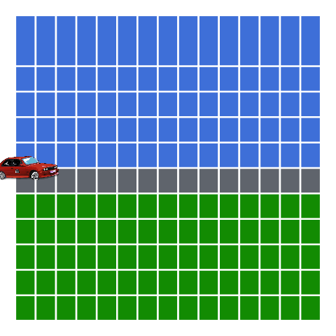

<!-- README.md is generated from README.Rmd. Please edit that file -->

```{r setup, include = FALSE}
knitr::opts_chunk$set(
  collapse = TRUE,
  comment = "#>"
)

library(emo)
```

**Team members `r emo::ji("farmer")` `r emo::ji("detective")`**

* `r emo::ji("cat")` [Adam Gruer](https://github.com/adam-gruer) `r emo::ji("bird")`  [\@AdamGruer](https://twitter.com/AdamGruer)
* `r emo::ji("cat")` [Saskia Freytag](https://github.com/SaskiaFreytag) `r emo::ji("bird")` [\@trashystats](https://twitter.com/trashystats)
* `r emo::ji("cat")` [Anna Quaglieri](https://github.com/SaskiaFreytag) `r emo::ji("bird")` [\@annaquagli](https://twitter.com/annaquagli)
* `r emo::ji("cat")` [Sarah Romanes](https://github.com/sarahromanes) `r emo::ji("bird")` [\@sarah_romanes](https://twitter.com/sarah_romanes)
* `r emo::ji("cat")` [Danielle Navarro](https://github.com/djnavarro) `r emo::ji("bird")` [\@djnavarro](https://twitter.com/djnavarro)
* `r emo::ji("cat")` [Roberto Bonelli](https://github.com/Robbie90) `r emo::ji("bird")` [\@robbie_bonelli](https://twitter.com/robbie_bonelli)
* `r emo::ji("cat")` [Emi Tanaka](https://github.com/emitanaka) `r emo::ji("bird")` [\@statsgen](https://twitter.com/statsgen)


# `learngganimate`





The goal of learngganimate is to record the discoveries of an intrepid
group of animation explorers in the wild `r emo::ji("tiger")`, amazing jungle `r emo::ji("tree")` of the [`gganimate` package](https://github.com/thomasp85/gganimate) `r emo::ji("package")`.

We aim to create documentation and share our user experience for this amazing `r emo::ji("star")`, yet sparsely documented, package `r emo::ji("package")`.

We collectively set our minds to the task of exploring the gganimate
package `r emo::ji("package")`.

We record our discoveries here for posterity:

  - [transition_manual](transition_manual.md)
  - [transition_filter](transition_filter.md)
  - [transition_components](transition_components.md)
  - [transition_layers](transition_layers.md)
  - [transition_reveal](transition_reveal/transition_reveal.md)
  - [transition_time](transition_time/transition_time.md)
  - [ease_aes](ease_aes.md)
  - [shadow_wake](shadow_wake.md)
  - [shadow_mark](shadow_mark.md)
  - [enter_exit](enter_exit/enter_exit.md)
  - [view_follow](view_follow.md)
  - [compare transition_time with transition_reveal](transition_time_vs_transition_reveal.md)
  - [harvest_animation (transition_time)](example_harvest_animation.md)
  - [help needed! example heart pumping (animate, transition_manual, transition_states)](example_heart_pumping.md)
  - [help needed! alluvial plot](alluvial_plot.md)
  - [transition_RUveal: using many of the gganimate functions](RuPaul_excercise/making_gganimate_fab.md)
  - [airplanes example: using transition_reveal](USflights.md)
  - [compare transitions](compare_transitions.md)
  
  
