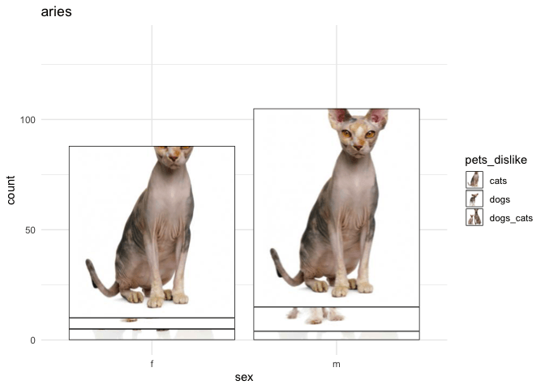

<!-- README.md is generated from README.Rmd. Please edit that file -->
**Authors**

-   [Adam Gruer](https://github.com/adam-gruer) @AdamGruer
-   [Saskia Freytag](https://github.com/SaskiaFreytag) @trashystats
-   [Anna Quaglieri](https://github.com/SaskiaFreytag) @annaquagli
-   [Sarah Romanes](https://github.com/sarahromanes) @sarah\_romanes
-   [Danielle Navarro](https://github.com/SaskiaFreytag) @djnavarro
-   [Roberto Bonelli](https://github.com/Robbie90) @robbie\_bonelli
-   [Emi Tanaka](https://github.com/emitanaka) @statsgen

`learngganimate`
================

The goal of learngganimate is to record the discoveries of an intrepid group of animation explorers in the wild, amazing jungle of [`gganimate` package](https://github.com/thomasp85/gganimate)

We aim to create documentation and share our user experience for this amazing, yet sparsly documented package.

we collectively set our minds to the task of exploring the gganimate package.

We record our discoveries here for posterity

<<<<<<< HEAD
-   [transition\_filter](transition_filter.md)
-   [transition\_manual](transition_manual.md)
-   [transition\_layers](transition_layers.md)
-   [transition\_reveal](transition_reveal/transition_reveal.md)
-   [transition\_time](transition_time/transition_time.md)
-   [ease\_aes](ease_aes.md)
-   [harvest\_animation](example_harvest_animation.md)
-   [shadow\_wake](shadow_wake.html)
-   [enter\_exit](enter_exit/enter_exit.md)
=======
  - [transition\_filter](transition_filter.md)
  - [transition\_manual](transition_manual.md)
  - [transition\_layers](transition_layers.md)
  - [transition\_reveal](transition_reveal/transition_reveal.md)
  - [transition\_time](transition_time/transition_time.md)
  - [ease\_aes](ease_aes.md)
  - [harvest\_animation](example_harvest_animation.md)
  - [shadow\_wake](shadow_wake.md)
  - [enter\_exit](enter_exit/enter_exit.md)
>>>>>>> 58162b99c3802ad71e15be09dbe3a0e3b9fa8046
