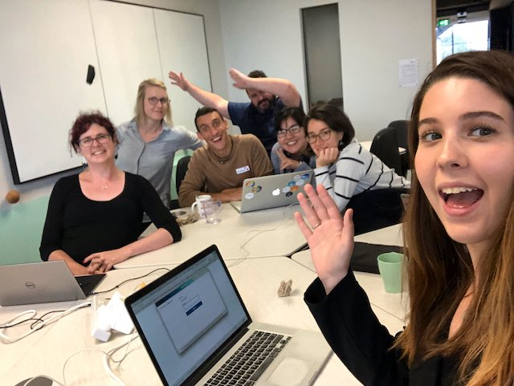

<!-- README.md is generated from README.Rmd. Please edit that file -->
`learngganimate`
================

`Coding together, learning together`
------------------------------------

**Team members** <U+0001F469><U+200D><U+0001F33E> <U+0001F575>

-   <U+0001F431> [Adam Gruer](https://github.com/adam-gruer) <U+0001F426> [@AdamGruer](https://twitter.com/AdamGruer)
-   <U+0001F431> [Saskia Freytag](https://github.com/SaskiaFreytag) <U+0001F426> [@trashystats](https://twitter.com/trashystats)
-   <U+0001F431> [Anna Quaglieri](https://github.com/SaskiaFreytag) <U+0001F426> [@annaquagli](https://twitter.com/annaquagli)
-   <U+0001F431> [Sarah Romanes](https://github.com/sarahromanes) <U+0001F426> [@sarah\_romanes](https://twitter.com/sarah_romanes)
-   <U+0001F431> [Danielle Navarro](https://github.com/djnavarro) <U+0001F426> [@djnavarro](https://twitter.com/djnavarro)
-   <U+0001F431> [Roberto Bonelli](https://github.com/Robbie90) <U+0001F426> [@robbie\_bonelli](https://twitter.com/robbie_bonelli)
-   <U+0001F431> [Emi Tanaka](https://github.com/emitanaka) <U+0001F426> [@statsgen](https://twitter.com/statsgen)

**Most wonderful contributors** <U+0001F64C>

-   <U+0001F431> [Dale Maschette](https://github.com/Maschette) <U+0001F426> [@Dale\_Masch](https://twitter.com/Dale_Masch)
-   <U+0001F431> [Jesse Mostipak](https://github.com/jmostipak) <U+0001F426> [@kierisi](https://twitter.com/kierisi)
-   <U+0001F431> [Will Chase](https://github.com/will-r-chase) <U+0001F426> [@W\_R\_Chase](https://twitter.com/W_R_Chase)

We'd love to add you to this list. Contributions are a most lovely thing you can do. Check out the [current issues](https://github.com/issues) for something you may want to help with. We can help you get started. Get in touch with us if you need help. Please check out our [contributing guide](CONTRIBUTING.md).

Please note that the `learngganimate` project is released with a [Contributor Code of Conduct](CODE_OF_CONDUCT.md). By contributing to this project, you agree to abide by its terms.

**Now, SOME GIFS!!**

The goal of learngganimate is to record the discoveries of an intrepid group of animation explorers in the wild <U+0001F42F>, amazing jungle <U+0001F334> of the [`gganimate` package](https://github.com/thomasp85/gganimate) <U+0001F4E6>.

We aim to create documentation and share our user experience for this amazing <U+2B50>, yet sparsely documented, package <U+0001F4E6>.

We collectively set our minds to the task of exploring the gganimate package <U+0001F4E6>.

We record our discoveries here for posterity:

-   [transition\_manual](transition_manual.md)
-   [transition\_filter](transition_filter.md)
-   [transition\_components](transition_components.md)
-   [transition\_layers](transition_layers.md)
-   [transition\_reveal](transition_reveal/transition_reveal.md)
-   [transition\_time](transition_time/transition_time.md)
-   [ease\_aes](ease_aes.md)
-   [shadow\_wake](shadow_wake.md)
-   [shadow\_mark](shadow_mark.md)
-   [shadow\_trail](shadow_trail.md)
-   [enter\_exit](enter_exit/enter_exit.md)
-   [view\_follow](view_follow.md)
-   [compare transition\_time with transition\_reveal](transition_time_vs_transition_reveal.md)
-   [harvest\_animation (transition\_time)](example_harvest_animation.md)
-   [help needed! example heart pumping (animate, transition\_manual, transition\_states)](example_heart_pumping.md)
-   [help needed! alluvial plot](alluvial_plot.md)
-   [transition\_RUveal: using many of the gganimate functions](RuPaul_excercise/making_gganimate_fab.md)
-   [airplanes example: using transition\_reveal](USflights.md)
-   [cool cool cool syn crossover](coolcoolcool.md)
-   [compare transitions](compare_transitions.md)
-   [animate and renderer options](animate.md)
