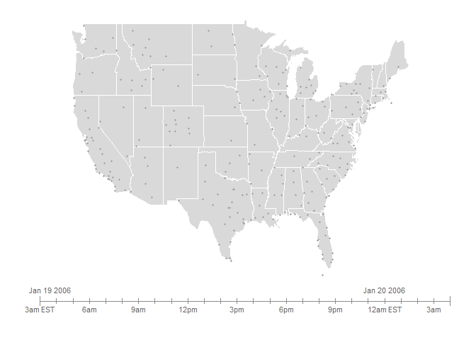
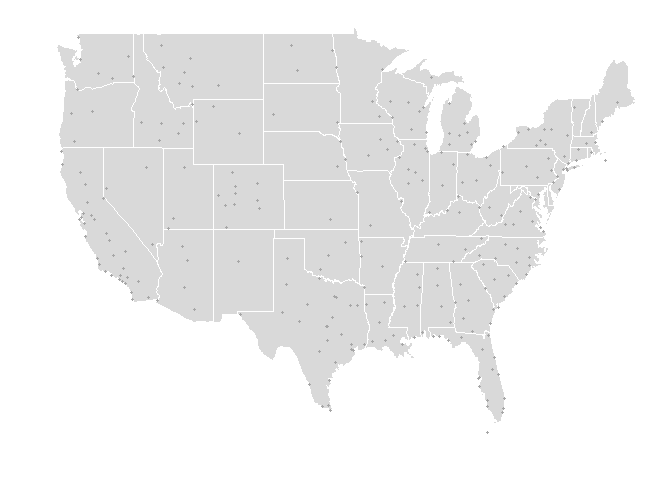
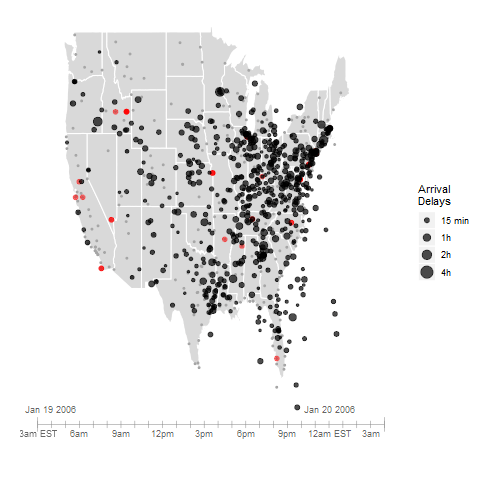

Airports
================
Sarah Romanes
23 November 2018

A quick example of `gganimate` on US flights data. Inspired by example [here](https://github.com/tidyverse/ggplot2/wiki/Flying-over-the-usa).

No time to explain the code behind this *at the moment*

<iframe src="https://giphy.com/embed/1hAsAJZ0NGt8rrxO5K" width="480" height="329" frameBorder="0" class="giphy-embed" allowFullScreen>
</iframe>
<p>
<a href="https://giphy.com/gifs/youngertv-tvland-younger-tv-1hAsAJZ0NGt8rrxO5K">via GIPHY</a>
</p>
... will explain ASAP!

Load necessary packages
-----------------------

``` r
library(tidyverse)
```

    ## -- Attaching packages -------------------------------------------------------------------------------------------------------------------------------------- tidyverse 1.2.1 --

    ## v ggplot2 3.1.0     v purrr   0.2.5
    ## v tibble  1.4.2     v dplyr   0.7.5
    ## v tidyr   0.8.1     v stringr 1.3.1
    ## v readr   1.1.1     v forcats 0.3.0

    ## Warning: package 'ggplot2' was built under R version 3.5.1

    ## -- Conflicts ----------------------------------------------------------------------------------------------------------------------------------------- tidyverse_conflicts() --
    ## x dplyr::filter() masks stats::filter()
    ## x dplyr::lag()    masks stats::lag()

``` r
library(gganimate)
library(maps)
```

    ## Warning: package 'maps' was built under R version 3.5.1

    ## 
    ## Attaching package: 'maps'

    ## The following object is masked from 'package:purrr':
    ## 
    ##     map

``` r
library(grid)
```

Load data
---------

``` r
airports <- read.csv("http://www.public.iastate.edu/~hofmann/looking-at-data/data/airports.csv")
states <- read.csv("http://www.public.iastate.edu/~hofmann/looking-at-data/data/states.csv")
flights <- read.csv("http://www.public.iastate.edu/~hofmann/looking-at-data/data/jan19.csv")
```

Necessary functions
-------------------

``` r
slider <- data.frame(x=c(-130,-130, -60, -60, -130, -60), y=1+c(20.5,21.5,20.5,21.5,21,21), id=c(1,1, 2,2, 3,3))

ticks <- data.frame(x=rep(seq(-130, -60, length=26), each=2),
                    y=rep(22+c(-0.25,0.25), 26),
                    id = 3+rep(1:26, each=2))
idx <- 1+ 6*0:8

getTSliderX <- function(time) {
  minT <- 3
  maxT <- 28
  time <- time %/% 100 + (time %% 100)/60
  x <- min(ticks$x)+1.0*(time - minT)/(maxT - minT) * diff(range(ticks$x))
  return(x)
}

# a set of personal choices for the map display
map.opts <- theme(panel.grid.minor=element_blank(), 
                  panel.grid.major=element_blank(),
                  panel.background=element_blank(),
                  axis.title.x=element_blank(),
                  axis.title.y=element_blank(),
                  axis.line=element_blank(),
                  axis.ticks=element_blank(),
                  axis.text.y  = element_text(colour="#FFFFFF"),
                  axis.text.x = element_text(colour = "#FFFFFF"))

(usamap <- ggplot() + geom_polygon(aes(x=x, y=y), data= states, fill="grey85", colour="white") +
    map.opts + 
    geom_point(aes(x=longitude, y=latitude), size=0.7, colour="grey65", data=subset(airports, (Volume > 1000) & (longitude >= -130) & (longitude <= -60) & (latitude >= 20) & (latitude <= 50))) +
    #   opts(legend.position="none") + 
    geom_line(aes(x=x, y=y, group=id), data=slider, colour="grey55", size=0.25) +
    geom_line(aes(x=x, y=y, group=id), data=ticks, colour="grey55", size=0.25) +
    annotate("text", x=-130, y=22.8, label=c("Jan 19 2006"), colour="grey40", size=3, hjust=0.25, vjust=0) + 
    annotate("text", x=-71.2, y=22.8, label=c("Jan 20 2006"), colour="grey40", size=3, hjust=0.5, vjust=0)  +
    #   annotate("text", x=ticks$x[1], y=22.8, label=c("Sep 11 2001"), colour="grey40", size=3, hjust=0.25, vjust=0) + 
    #   annotate("text", x=ticks$x[nrow(ticks)-2], y=22.8, label=c("Sep 12 2001"), colour="grey40", size=3, hjust=0.5, vjust=0)  +
    #   annotate("text", x=ticks$x[1], y=22.8, label=c("Sep 14 2004"), colour="grey40", size=3, hjust=0.25, vjust=0) + 
    #   annotate("text", x=ticks$x[nrow(ticks)-2], y=22.8, label=c("Sep 15 2004"), colour="grey40", size=3, hjust=0.5, vjust=0)  +
    #   annotate("text", x=-130, y=22.8, label=c("Mar 13 1993"), colour="grey40", size=3, hjust=0.25, vjust=0) + 
    #   annotate("text", x=-71.2, y=22.8, label=c("Mar 14 1993"), colour="grey40", size=3, hjust=0.5, vjust=0)  +
    geom_text(aes(x=x, y=y, label=c( "3am EST", "6am", "9am", "12pm", "3pm", "6pm", "9pm", "12am EST", "3am")), data=ticks[idx,], colour="grey40", size=3, hjust=0.5, vjust=1.25)  
  
)
```



``` r
# Advanced: Flight Track

# flightTrack returns approximate latitude and longitude of a plane

flightTrack <- function(fromXY, toXY, ratio, seed) {
  # from XY and toXY are GPS coordinates of origin and destination airports
  # ratio is a number between 0 and 1, indicating how much of the distance 
  # the plane has travelled, with 0 indicating the origin and 1 indicating 
  # the destination
  # seed is the seed used in the random number generator - here we use 
  # ArrTime*DepTime to uniquely identify each flight
  
  rand <- sapply(seed, function(x) {
    set.seed(x)
    return(runif(1,-.5,.5))
  })
  
  dir <- toXY-fromXY
  orth <- rev(dir)
  orth[,1] <- orth[,1]*(-1)
  
  location <- fromXY+ratio*dir+(1-ratio)*ratio*orth*rand
  return(list(location=location, seed=seed))    
}

# compute time in air, extract GPS coordinates for airports

airport.location <- function(iata) {
  idx <- unlist(sapply(iata, function(x) return(which(airports$iata %in% x))))
  x <- airports[idx,7:6]
  return (x)
}

getAircraftLocation <- function(df) {
  # helper function: get coordinates for airport
  cancelled <- subset(df, Cancelled==1)
  df <- subset(df, Cancelled==0)
  
  # get GPS coordinates of airports
  origXY <- airport.location(df$Origin)
  destXY <- airport.location(df$Dest)
  
  # compute air time based on departure and arrival times
  airtime <- with(df, (ArrTime %% 100 - DepTime %% 100) + (ArrTime%/%100 - DepTime%/%100)*60)
  
  # compute the ratio flown, adjust for possible data errors
  flown <- with(df, (time %% 100 - DepTime %% 100) + (time%/%100 - DepTime%/%100)*60)
  flown[flown < 0] <- 0
  ratio <- flown/airtime
  ratio[is.na(ratio)] <- 0
  ratio[ratio > 1] <- 1
  
  # render flights on straight line
  # return(origXY+ratio*(destXY-origXY))
  
  # render flights on arcs with random curvature
  res <- flightTrack(origXY, destXY, ratio, df$DepTime*df$ArrTime)
  return(list(location=res$location, id=res$seed))
}


# get all flights in the air and all flights that have been cancelled

getFlights <- function(df, tp, interval) {
  # df is the data set to subset
  # tp is the time point
  
  startHour <- tp
  endHour <- tp + interval
  if (endHour %% 100 >= 60) {
    endHour <- (endHour - 60) + 100
  }     
  
  tm <- subset(df, ((DepTime < endHour) & (ArrTime > startHour)) | 
                 ((CRSDepTime %in% (startHour:endHour)) & (Cancelled == 1)))
  
  return(tm)
}
```

The `gganimate` looking at flight delays from 9am to 9.40 am on Jan 19, 2006.
-----------------------------------------------------------------------------

``` r
t1 <- getFlights(flights, 900,10)
t2 <- getFlights(flights, 910,10)
t3 <- getFlights(flights, 920,10)
t4 <- getFlights(flights, 930,10)


t1 <- cbind(t1, time =rep(900, nrow(t1)))
t2 <- cbind(t2, time =rep(910, nrow(t2)))
t3 <- cbind(t3, time =rep(920, nrow(t3)))
t4 <- cbind(t4, time =rep(930, nrow(t4)))

test <- rbind(t1,t2,t3,t4)
res <- test


cancel <- subset(res, Cancelled==1)
res <- subset(res, Cancelled==0)


q <- usamap 
q
```



``` r
vals <- getAircraftLocation(res[,c("Origin", "Dest", "DepTime", "ArrTime", "time", "Cancelled")])
loc <- vals$location

loc$delay <- with(res, pmax(ArrDelay,0))
loc$delay <- with(res, pmin(ArrDelay,300))
loc$time <- res$time
loc$id <- as.factor(vals$id)
               
               
if (nrow(cancel) > 0) {
cancelxy <- airport.location(cancel$Origin)
                 q <- q + geom_jitter(aes(x=longitude, y=latitude), size=2, colour = I(alpha("red",5/10)), data=cancelxy)
              }
               
q <- q +  ylim(c(21, 49.4)) + xlim(-130, -60) + 
                       geom_point(aes(x=longitude, y=latitude, size=delay), 
                                  colour = I(alpha("black", 7/10)), data=loc) + 
  scale_size(name="Arrival\nDelays", breaks=c(15, 60, 120, 240), labels=c("15 min",  "1h", "2h", "4h"), limits=c(0,300))
               
    
q <- q + transition_reveal(along=time, id=id) +
  enter_fade() + 
  exit_shrink()

animate(q, type="cairo", ref_frame=50)
```



I don't quite think this is giving me what I want yet - but work in progress - stay tuned (not sure what the rogue super sonic speed points are doing)
