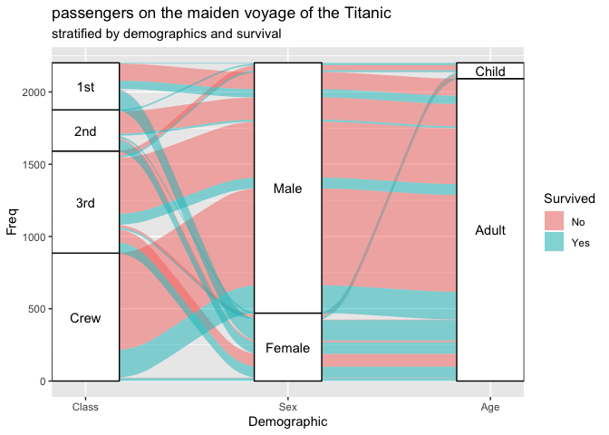

Alluvial
================
Adam Gruer
23/11/2018

``` r
install.packages("ggalluvial")
```

``` r
library(ggplot2)
library(ggalluvial)
library(gganimate)
```

# ICEBERG\!\!\!

## Static

``` r
ggplot(data = to_lodes_form(as.data.frame(Titanic),
                            key = "Demographic",
                            axes = 1:3),
       aes(x = Demographic, stratum = stratum, alluvium = alluvium,
           y = Freq, label = stratum)) +
  scale_x_discrete(expand = c(.05, .05)) +
  geom_alluvium(aes(fill = Survived)) +
  geom_stratum() +
  geom_text(stat = "stratum") +
  ggtitle("passengers on the maiden voyage of the Titanic",
          "stratified by demographics and survival") 
```

<!-- -->

## Animated. HELP\! SOS\!

Wondering how I might animate the above chart. First attempt error:

> Error in mapply(FUN = f, …, SIMPLIFY = FALSE) : zero-length inputs
> cannot be mixed with those of non-zero length

``` r
ggplot(data = to_lodes_form(as.data.frame(Titanic),
                            key = "Demographic",
                            axes = 1:3),
       aes(x = Demographic, stratum = stratum, alluvium = alluvium,
           y = Freq, label = stratum)) +
  scale_x_discrete(expand = c(.05, .05)) +
  geom_alluvium(aes(fill = Survived)) +
  geom_stratum() +
  geom_text(stat = "stratum") +
  ggtitle("passengers on the maiden voyage of the Titanic",
          "stratified by demographics and survival") +
  transition_manual(Demographic)
```
