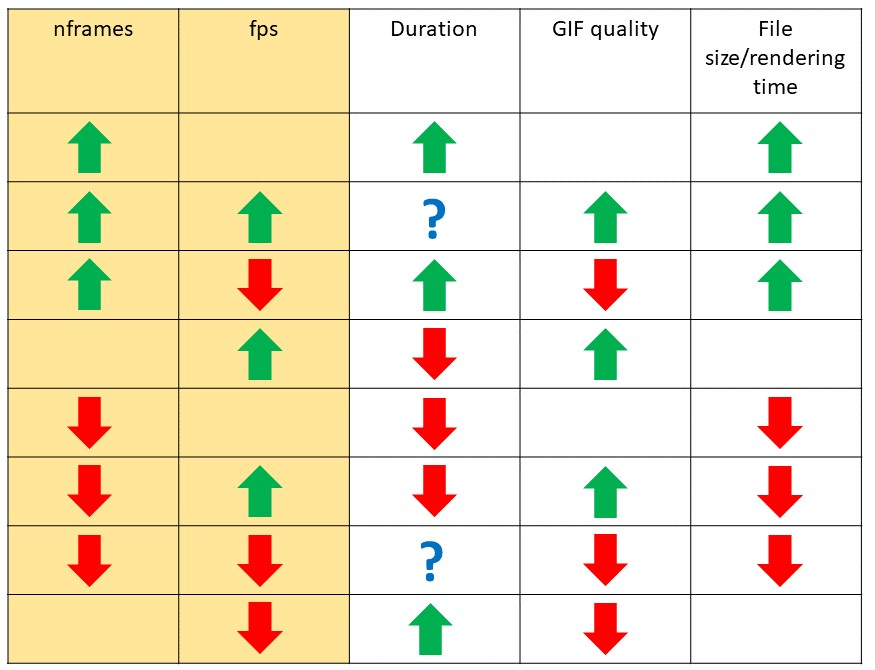

```{r setup, include=FALSE}
knitr::opts_chunk$set(echo = TRUE, warning = FALSE, message = FALSE, cache = TRUE)
```
**Table of Contents**

- [Basics](#basics)
  - [Controlling animation speed and quality](#controlling-animation-speed-and-quality)
  - [Saving your animation](#saving-your-animation)
- [Advanced](#advanced)
  - [`type` argument (why your animation is pixelated on Windows)](#type-argument-why-your-animation-is-pixelated-on-windows)
  - [`detail` argument (making smoother animations)](#detail-argument-making-smoother-animations)
  - [Renderer options](#renderer-options)
  - [Changing default arguments of `animate()`](#changing-default-arguments-of-animate)
  - [Knitr support](#knitr-support)


All of the `transition_` `ease_` `view_` etc. functions in gganimate will build a series of static images. To actually assemble those images into an animation, you will need to call the `animate()` function. This function seems simple, but much like file paths, what seems simple can cause great headaches. `animate()` actually combines many "under the hood" features and video rendering concepts that are not obvious to the majority of R users, but can make the difference between a beautiful smooth animation, and a choppy (or even incorrect) animation.


# Basics

## Controlling animation speed and quality

Let's start understanding this with a simple example using the mtcars data.

```{r}
library(ggplot2)
library(gganimate)

anim <-
  ggplot(mtcars, aes(factor(cyl), mpg)) + 
  geom_boxplot() + 
  transition_states(
    gear,
    transition_length = 3,
    state_length = 1
  ) +
  enter_fade() + 
  exit_shrink() +
  ease_aes('linear')
```

There are three critical factors that affect the speed and look of your animation: number of frames (`nframes`), frames per second (`fps`), and duration (`duration`). These parameters are related by the formula `duration(milliseconds) = nframes * fps` In gganimate, you can set two of these, and the third will be calculated. The default values are `nframes = 100` and `fps = 10`. Calling the animation object (`anim`) or `print(anim)` will create an animation with the default values.

```{r fig.align="center", out.width="60%"}
anim
```

If we want to change the way this animation looks, we can call `animate()` directly and set the `nframes` and `fps` arguments. You can also set the `duration` argument with either of the other two, but I find it is easier to just set nframes and fps. Increasing `nframes` will increase the duration of the animation, and also increase the rendering time and file size of the output. Increasing `fps` will reduce the duration, but increase the "quality" of the animation, making it smoother. Here's a table that shows how changing `nframes` and `fps` will affect the final animation (a blank space means little to no change):



Let's see it in action

```{r}
#slow and choppy animation
animate(anim, nframes = 200, fps = 5)
```
```{r}
#fast and smooth animation
animate(anim, nframes = 100, fps = 20)
```

The goal is to strike a balance between rendering time/file size and quality. Usually 10 fps and 100 frames is a good starting point, but for animations with lots of movement, shadows, wakes, etc. You may want to go higher quality.

You can also set the size (in pixels) of the output animation using the `width` and `height` arguments.

## Saving your animation

Animations can be saved using the `anim_save()` function. You can specify a particular animation object to save, or by default it will save the last animation you made. 


# Advanced

## `type` argument (why your animation is pixelated on Windows)

This is where we start going down the rabbit hole. If you've made an animation on a Windows machine with lots of points, or with shadows or wakes, you will notice that there is some weird jittering or pixelation in your animation. I'll use Danielle Navarro's brownian bridge animation to demonstrate.

```{r fig.align="center"}
library(tidyverse)
library(e1071)
library(gganimate)

ntimes <- 20  # how many time points to run the bridge?
nseries <- 10 # how many time series to generate?

# function to generate the brownian bridges
make_bridges <- function(ntimes, nseries) {
  replicate(nseries, c(0,rbridge(frequency = ntimes-1))) %>% as.vector()
}

# construct tibble
tbl <- tibble(
  Time = rep(1:ntimes, nseries),
  Horizontal = make_bridges(ntimes, nseries),
  Vertical = make_bridges(ntimes, nseries),
  Series = gl(nseries, ntimes)
)

base_pic <- tbl %>%
  ggplot(aes(
    x = Horizontal, 
    y = Vertical, 
    colour = Series)) + 
  geom_point(
    show.legend = FALSE,
    size = 5) + 
  coord_equal() + 
  xlim(-2, 2) + 
  ylim(-2, 2) +
  transition_time(time = Time) + 
  shadow_wake(wake_length = 0.2)

animate(base_pic, nframes = 100, fps = 10)
```

It's clear that there's something wrong with the wake, as we can see the wake points don't trail in a straight line. You only get this on a Windows machine, and it has to do with the base .png images that are used to build the animation. gganimate first renders a series of .png images and then we stitch them together with `animate()` but in Windows, the default method to make .png's in R doesn't use **anit-aliasing** which leads to pixelated edges. The way to fix this is using the `type` argument. First you need to have the `Cairo` library installed, then set the argument `type = "cairo"` when you call `animate()`. Voila!

```{r fig.align="center"}
#render with cairo device
animate(base_pic, nframes = 100, fps = 10, type = "cairo")
```

## `detail` argument (making smoother animations)

In the last brownian bridge example, we got a pretty nice looking animation, but what if we want to have a smooth trail instead of points for our `shadow_wake()`? One way to do this is by increasing the fps. I'll try this, while also increasing the frames so that the animation is the same speed overall. 

```{r fig.align="center"}
#increase frames and fps
animate(base_pic, nframes = 300, fps = 30, type = "cairo")
```

Another option is to set the `detail` argument. Looking at the documentation, details does this: "you can increase the `detail` argument. `detail` will get multiplied to `nframes` and the resulting number of frames will get calculated, but only `nframes` evenly spaced frames are rendered." I think what this means is that it will increase the frames without increasing the duration (someone correct this if it's wrong). Let's try it!

```{r fig.align="center"}
#increase detail
animate(base_pic, nframes = 100, fps = 10, type = "cairo", detail = 3)
```

The difference between specifying the `detail` parameter and changing the frames/fps is that changing `detail` does not significantly increase the output file size, although it does increase rendering time. 

## Renderer options

We now know that gganimate creates a series of static images, and then stitches them together to form the animation. There are several options related to both of these steps that we can set to affect the final product. First, we can set the `device` argument in `animate` to change the format of the static images. We can choose `'png'`, `'jpeg'`, `'tiff'`, `'bmp'`, `'svg'`, and `'svglite'`. 

A more interesting decision is which renderer to use. By default gganimate will use `gifski_renderer` and produce a .gif output, but we can use different renderers and each one has associated arguments that can make some neat outputs. 

- **`gifski_renderer`**: Returns a [gif_image] object
  + `gifski_renderer(loop = FALSE)` will stop on the final frame of the animation
- **`file_renderer`**: Returns a vector of file paths, this can be used to save the individual frames as .png or other image formats
- **`av_renderer`**: Returns a [video_file] object
  + `av_renderer(audio = audio)` will associate an audio track with your animation
- **`ffmpeg_renderer`**: Returns a [video_file] object
- **`magick_renderer`**: Returns a `magick-image` object

There are also many options that can be set for video files, especially with ffmpeg, such as the codec used for rendering. These are explained further in the help file for `renderers()`. 

Let's try some!

```{r fig.align="center"}
#stop on last frame
animate(base_pic, nframes = 100, fps = 10, detail = 3, type = "cairo", renderer = gifski_renderer(loop = FALSE))
```

```{r eval=FALSE}
#render as video with audio 
animate(base_pic, nframes = 100, fps = 10, detail = 3, type = "cairo", renderer = av_renderer(audio = "animate_files/500_miles.WMA"))
```

Videos can't be rendered in github docs. Click the thumbnail to view this animation as a **video with sound!**

[](https://www.williamrchase.com/slides/500_miles.mp4)

## Changing default arguments of `animate()`

In any R session or script you can change the default values of the `animate()` function using `options()`. For example you could lower the default nframes if you plan to render lots of short animations, or you could change the default detail if you are using `shadow_wake()` a lot. Set these using `options(gganimate.arg = x)` 

```{r eval = F}
#change default nframes to 50
options(gganimate.nframes = 50)

#change default detail to 3
options(gganimate.detail = 3)

#change default output to video using av renderer
options(gganimate.renderer = av_renderer())
```

If you want to set the default device arguments passed to gganimate with `...` you need to set `options(gganimate.dev_args = list())`. To make sure that your scripts are reproducible across different operating systems, I recommend you set the default `type = "cairo"`

```{r eval = F}
#change default png device to cairo
options(gganimate.dev_args = list(type = "cairo"))

#change default height and width of plots
options(gganimate.dev_args = list(height = 600, width = 800))
```

## Knitr support

Copy+paste from the gganimate help:

It is possible to specify the arguments to `animate()` in the chunk options when using `gganimate` with `knitr`. Arguments specified in this way will have precedence over defaults, but not over arguments specified directly in `animate()`. The arguments should be provided as a list to the `gganimate` chunk option, e.g. `{r, gganimate = list(nframes = 50, fps = 20)}`. A few build-in knitr options have relevance for animation and will be used unless given specifically in the `gganimate` list option. The native knitr options supported are:

- `interval`: will set fps to `1/interval`
- `dev`: will set `device`
- `dev.args`: will set additional arguments to the device (`...`)
- `fig.width`, `fig.height`, `fig.asp`, `fig.dim`: will set `width` and `height` of the device.

