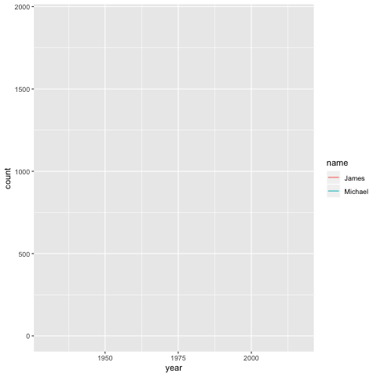
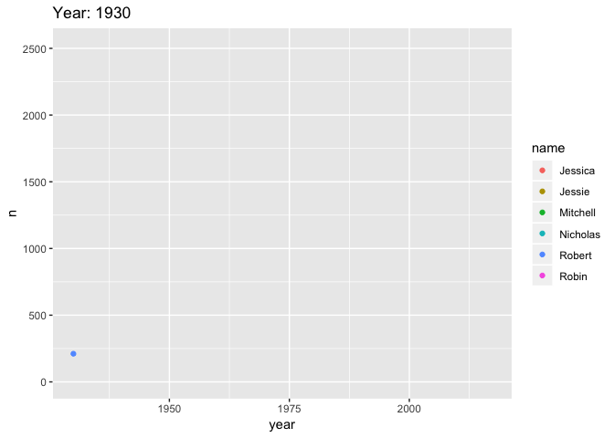

Compare transitions
================
Anna Quaglieri
24/11/2018

-   [What are the differences between `transition_reveal` and `transition_component`?](#what-are-the-differences-between-transition_reveal-and-transition_component)

This document is very very preliminary!

What are the differences between `transition_reveal` and `transition_component`?
================================================================================

-   **geom\_line()** with `transition_component()` throws and error: `Error: Unsupported layer type`

``` r
library(ggrepel)
p=ggplot(ozbabynames[ozbabynames$name %in% c("Michael","James"),]) + 
  geom_point(aes(x=year,y=count,colour=name)) +
  geom_line(aes(x=year,y=count,colour=name,group=name)) +
  transition_components(id=name,time=year)+
  shadow_trail(distance = 2, size = 2)
animate(p,nframes = 20)
```

``` r
p2=ggplot(ozbabynames[ozbabynames$name %in% c("Michael","James"),]) + 
  geom_line(aes(x=year,y=count,colour=name,group=name)) +
  transition_reveal(id=name,along=year,keep_last = FALSE)+
  shadow_trail(distance = 0.01, size = 2)
animate(p2,nframes = 100,duration = 10)
```



-   In order to show the transition across time you use `{frame_along}` from `transition_reveal` and `{frame_time}` in `transition_components`...

``` r
library(tidyverse)
author_names <- c("Robin", "Robert", "Mitchell", "Nicholas", "Jessie", "Jessica")

dat <- ozbabynames %>%
  filter(name %in% author_names) %>%
  count(name,year, wt = count) 

p2=ggplot(dat) + 
  geom_point(aes(x=year,y=n,colour=name)) +
  transition_components(id=name,time=year)+
  shadow_trail(distance = 0.01, size = 2)+
  labs(title="Year: {frame_time}")
p2
```


``` r
p2=ggplot(dat) + 
  geom_point(aes(x=year,y=n,colour=name)) +
  transition_components(id=name,time=year)+
  shadow_trail(distance = 0.01, size = 2)+
  labs(title="Year: {frame_time}")
p2
```


