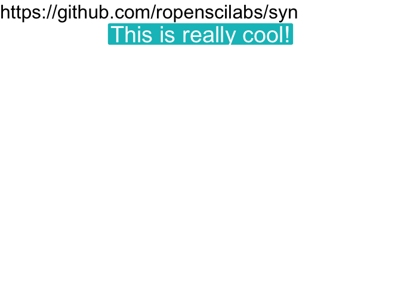

Syn
================
Adam Gruer
23/11/2018

``` r
devtools::install_github("ropenscilabs/syn")
```

``` r
library(ggplot2)
library(syn)
library(gganimate)
library(dplyr)
```

    ## 
    ## Attaching package: 'dplyr'

    ## The following objects are masked from 'package:stats':
    ## 
    ##     filter, lag

    ## The following objects are masked from 'package:base':
    ## 
    ##     intersect, setdiff, setequal, union

# Cool, Cool, Cool, Cool\!

``` r
theme_set(theme_minimal())

## basic example code
synonyms <- syn("cool") 
cool_df <- data_frame(sentence = paste0("This is really ", synonyms[1:10], "!"), x = factor("a"),  y = seq(100, 10, -10) )

ggplot(cool_df,(aes(x,y, label = sentence, group = sentence, fill = sentence))) +
  geom_label(size = 10,colour = "white",show.legend = FALSE) +
  theme_void() +
  transition_reveal(sentence, along = 100 - y) +
  enter_grow() +
  labs(title="https://github.com/ropenscilabs/syn") +
  theme(title = element_text(size = 20))
```

<!-- -->
