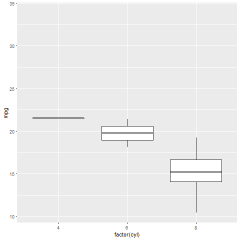
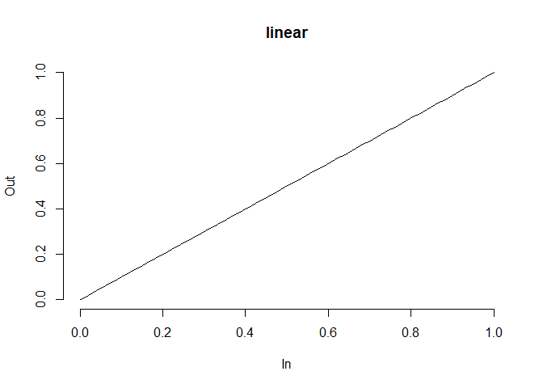
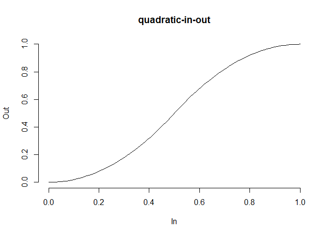

ease\_aes - a walkthrough
================
Sarah Romanes
22 November 2018

What does `ease_aes()` do?
==========================

> ease\_aes() defines how different aesthetics should be eased during transitions.

I like to think of ease describing the *acceleration* of our transition. Should it have a constant speed? Should it speed up, or slow down? Or should it bounce around? We can control this using this component of `gganimate`.

There are **two** components to the `ease_aes` function, which are drawn from the `tweenr` package. They are

-   The name of the easing function to display: `ease`
-   And the modifier for said `ease` function, in the form of `-in`, `-out`, or `-in-out`.

Each ease\_aes() command requires the ease function AND the modifier, *except* for the special case of the `linear function`.

The `ease` function
-------------------

The ease function controls the *shape* of the acceleration. For example, `linear` will produce a constant speed for the transition, whereas `bounce` will provide a bouning effect!

A list of the easing functions can be found [here](https://www.rdocumentation.org/packages/tweenr/versions/0.1.5/topics/display_ease), and they can easily be visualised with the use of the `tweenr` package as follows:

``` r
par(mfrow=c(1,2))
tweenr::display_ease('linear')
tweenr::display_ease('bounce-in')
```


**Constant rate of change**

``` r
ggplot(mtcars, aes(factor(cyl), mpg)) + 
  geom_boxplot() + 
  transition_states(
    gear,
    transition_length = 3,
    state_length = 1
  ) +
  enter_fade() + 
  exit_shrink() +
  ease_aes('linear')
```



**Bouncing**

``` r
ggplot(mtcars, aes(factor(cyl), mpg)) + 
  geom_boxplot() + 
  transition_states(
    gear,
    transition_length = 3,
    state_length = 1
  ) +
  enter_fade() + 
  exit_shrink() +
  ease_aes('bounce-out')
```


The affect of the modifiers
===========================

Motivation
----------

For the `linear` ease function, it is clear the rate of change is constant - so there is only one possible linear combination

``` r
tweenr::display_ease('linear')
```



However, for the `quadratic` function, we have two options.

``` r
par(mfrow=c(1,2))
tweenr::display_ease('quadratic-in')
tweenr::display_ease('quadratic-out')
```


It is clear that the role of the `-in` and `-out` modifiers is to change which *reflection* on the line *y=x* our function is on. This has the affect of changing concavity, or more pratically, the type of acceleration. In the `quadratic-in` example, our transition state is *speeding up* as time progresses. However, in `quadratic-out`, our transition state is *slowing down* as time progresses.

**Speeding up**

``` r
ggplot(mtcars, aes(factor(cyl), mpg)) + 
  geom_boxplot() + 
  transition_states(
    gear,
    transition_length = 3,
    state_length = 1
  ) +
  enter_fade() + 
  exit_shrink() +
  ease_aes('quadratic-in')
```


**Slowing down**

``` r
ggplot(mtcars, aes(factor(cyl), mpg)) + 
  geom_boxplot() + 
  transition_states(
    gear,
    transition_length = 3,
    state_length = 1
  ) +
  enter_fade() + 
  exit_shrink() +
  ease_aes('quadratic-out')
```


### The `-in-out` modifier

The `in-out` modifier essentially appends the two accelerations together, speeding up and then slowing down. We can visualise this with the quadratic function as follows:

``` r
tweenr::display_ease('quadratic-in-out')

ggplot(mtcars, aes(factor(cyl), mpg)) + 
  geom_boxplot() + 
  transition_states(
    gear,
    transition_length = 3,
    state_length = 1
  ) +
  enter_fade() + 
  exit_shrink() +
  ease_aes('quadratic-in-out')
```


