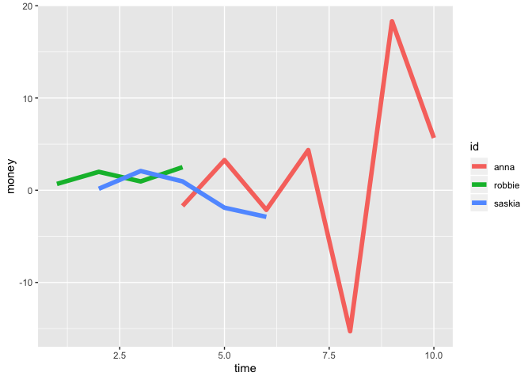
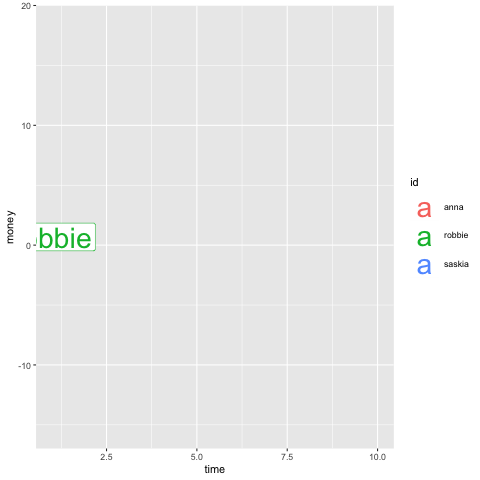
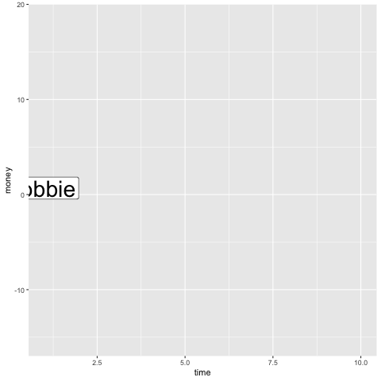
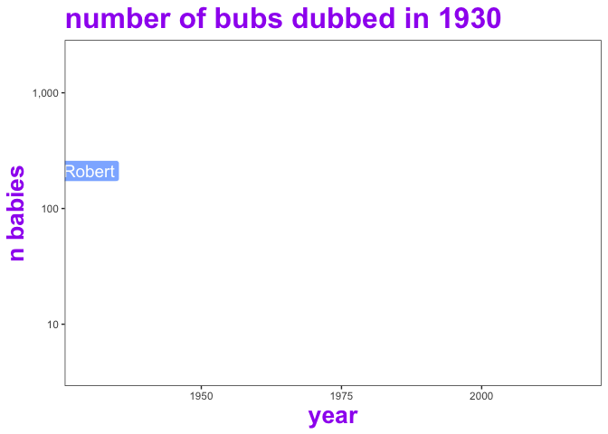

enter\_exit
================
Robbie Bonelli
22/11/2018

# What does `transition_time()` do?

> The purpose of enter\_*() and exit\_*() is to control what happens
> with data that does not persist during a tween.

In simple words it controls how data that either appear and or disapper
in the plot because of the animation will enter or exit the plot.

To understand
better:

## Create fake data

``` r
dat <- data.frame(id=c(rep("robbie",4),rep("saskia",5),rep("anna",7)),time=c(1:4,2:6,4:10))
dat$money <- rnorm(nrow(dat))*dat$time

ggplot(dat)+geom_line(aes(x=time,y=money,group=id,color=id),size=2)
```

<!-- -->

This dataset contains time data for three people and how much money they
have. Note that each person enters the total time frame for a limited
amount of time. This means that if we animate around time, some people
should disappers and appers depending on the time point we are
visualising.

These parameters let you control
that\!

# Simple sudden apper

``` r
p <- ggplot(dat, aes(x=time,group=id))+ geom_label(aes(y=money,label=id,color=id),size=10) +  transition_time(time=time)+enter_appear()+exit_disappear()
animate(p)
```

<!-- -->

## Growing and Shrinking

``` r
p <- ggplot(dat, aes(x=time,group=id))+ geom_label(aes(y=money,label=id,color=id),size=10) +  transition_time(time=time)+enter_grow()+exit_shrink()
animate(p)
```

<!-- -->

## Fading

``` r
p <- ggplot(dat, aes(x=time,group=id))+ geom_label(aes(y=money,label=id,color=id),size=10) +  transition_time(time=time)+enter_fade()+exit_fade()
animate(p)
```

<!-- -->

# Enter or Exit need the grouping factor\!

Let’s try to take off the
grouping

``` r
p <- ggplot(dat, aes(x=time))+ geom_label(aes(y=money,label=id),size=10) +  transition_time(time=time)+enter_appear()+exit_disappear()
animate(p)
```

<!-- -->

As we see this not work properly\!

# oz baby names

Use the oz baby names backage to show how a selection of names have
varied in popularity in Australia over time.

This animation uses `geom_line()` and `geom_label()` with a
`transition_reveal()` and `enter_grow(fade = TRUE)` and
`exit_shrink(fade = TRUE)`.

For these line chart reveal animations it’s important in the `ggplot`
portion of code to set the `group` aesthetic equal to the variable you
are interested in tracing (it may help to think of it as the variable
you would facet over in a static plot). This `id` argument of the
`transition_reveal` function should also be set to this same
variable.

``` r
install_github("ropenscilabs/ozbabynames")
```

``` r
library(ozbabynames)
```

``` r
author_names <- c("Robin", "Robert", "Mitchell", "Nicholas", "Jessie", "Jessica")

ozbabynames %>%
  filter(name %in% author_names) %>%
  count(name,year, wt = count) %>%
  ggplot(aes(x = year, 
             y = n,
             colour = name,
             group = name,
             label = name,
             fill = name)) +
  geom_line(size = 1, linetype = "dotted") +
  geom_label(colour = "white", alpha = 0.75, size =  5) +
  theme_bw() +
  theme(panel.grid = element_blank(),
        legend.position = "none",
        title = element_text(colour = "purple",
                             size = 20,
                             face = "bold")
        ) +
  labs( title = "number of bubs dubbed in {frame_along} ",
        y = "n babies" ) +
  scale_y_log10(labels = scales::comma) +
  transition_reveal(id = name, along = year) +
  enter_grow(fade = TRUE) +
  exit_shrink(fade = TRUE)
```

<!-- -->

``` r
  #shadow?
  #ease?
```
