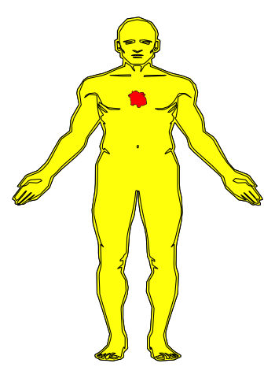
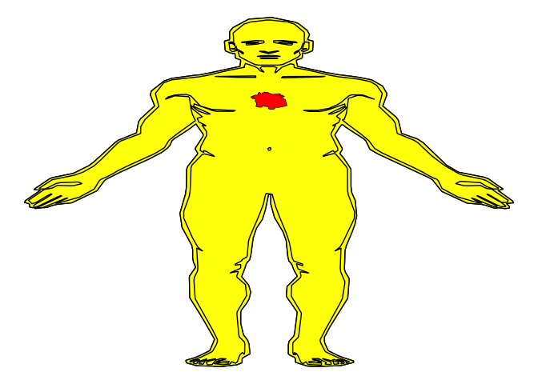

Heart Pumping
================
Emi Tanaka
22/11/2018

Note that you will need to install `transformr` from thomasp85 or else
you will run into the following error:

> Error in transform\_path(all\_frames, next\_state, ease,
> params$transition\_length\[i\], : transformr is required to tween
> paths and lines

For more info, see this relevant github
[issue](https://github.com/thomasp85/gganimate/issues/190).

``` r
## install from Github
devtools::install_github("jespermaag/gganatogram")
devtools::install_github("thomasp85/transformr") # to avoid error in in transition_states demonstration
```

``` r
library(gganimate)
library(gganatogram)
library(dplyr)

body <- hgMale_list$human_male_outline %>% 
  mutate(index=1:nrow(.)) %>%
  group_by(group) %>%
  summarise(x=NA, y=NA, index=0) %>%
  bind_rows(., hgMale_list$human_male_outline) %>% 
  arrange(group, index) %>% 
  select(x, y)
heart1 <- heart2 <- hgMale_list$heart[-1,]
heart2 <- heart2 %>% 
  mutate(x=1.3*(x - mean(x)) + mean(x),
         y=1.3*(y - mean(y)) + mean(y),
         state=2)
heart1 <- heart1 %>% 
  mutate(x=0.8*(x - mean(x)) + mean(x),
         y=0.8*(y - mean(y)) + mean(y),
         state=1)
heart <- rbind(heart1, heart2) %>% select(x, y, state)
```

``` r
ga <- ggplot(data=body, aes(x, -y)) +
  geom_path() +
  geom_polygon(fill="yellow", colour="black") +
  geom_path(data=heart, aes(x, -y)) + 
  geom_polygon(data=heart, aes(x, -y), fill="red") + 
  theme_void() +
  ease_aes('quadratic-in-out') +
  transition_states(state,
                    transition_length=3,
                    state_length=1) 

animate(ga, nframes=10, width=350)  
```

<!-- -->

`transition_manual` is another alternative that achieves a similar
animation. I also learnt that setting the nframes argument of the
`animate` function to a small number makes the heart beat faster than a
larger number.

``` r
ga <- ggplot(data=body, aes(x, -y)) +
  geom_path() +
  geom_polygon(fill="yellow", colour="black") +
  geom_path(data=heart, aes(x, -y)) + 
  geom_polygon(data=heart, aes(x, -y), fill="red") + 
  theme_void()  +
  ease_aes('quadratic-in-out') +
  transition_manual(state) 
animate(ga, nframes=5, width=350)  
```

<!-- -->
