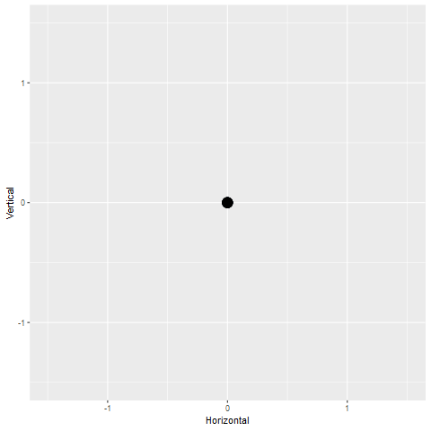
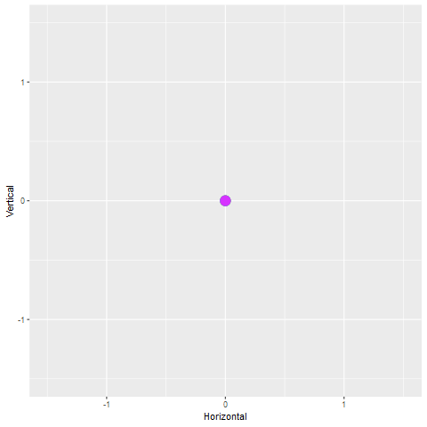
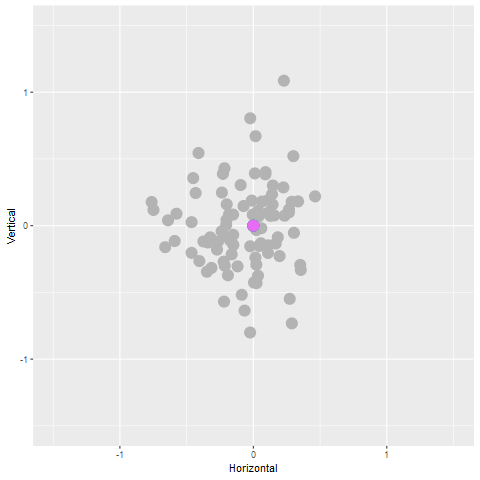

shadow\_mark
================
Danielle Navarro & Dale Maschette
22/11/2018

This `shadow_mark()` walk through extends the `shadow_wake()` walk through and uses the same animation.

``` r
ntimes <- 20  # how many time points to run the bridge?
nseries <- 5 # how many time series to generate?

# function to generate the brownian bridges
make_bridges <- function(ntimes, nseries) {
  replicate(nseries, c(0,rbridge(frequency = ntimes-1))) %>% as.vector()
}

# construct tibble
tbl <- tibble(
  Time = rep(1:ntimes, nseries),
  Horizontal = make_bridges(ntimes, nseries),
  Vertical = make_bridges(ntimes, nseries),
  Series = gl(nseries, ntimes)
)

# construct the base picture
base_pic <- tbl %>%
  ggplot(aes(
    x = Horizontal, 
    y = Vertical, 
    colour = Series)) + 
  geom_point(
    show.legend = FALSE,
    size = 5) + 
  coord_equal() + 
  xlim(-1.5, 1.5) + 
  ylim(-1.5, 1.5)

# base animation with no shadow
base_anim <- base_pic + transition_time(time = Time) 
base_anim %>% animate()
```


See the other walk through for details.

Minimal use of shadow mark
--------------------------

``` r
mark0 <- base_anim + shadow_mark()
mark0 %>% animate(type = "cairo")
```


Setting fixed aesthetics
------------------------

``` r
mark1<- base_anim + 
  shadow_mark(
    size = 2, 
    alpha = 0.8,
    colour = "black"
  )
mark1 %>% animate(type = "cairo")
```


Excluding layers
----------------

Suppose we want to solve Dale's problem in a much simpler way: keep the colours on the shadow mark, but have the original dots all be black. Solution is to add another layer but exclude it from the shadow mark:

``` r
new_pic <- base_pic + 
  geom_point(colour = "black", size = 5)

mark2 <- new_pic + 
  transition_time(time = Time) + 
  shadow_mark(size = 2, exclude_layer = 2)

mark2 %>% animate(type = "cairo")
```



In some cases the shadow mark might need to rendered using a different colour palette than the main points. This is slightly trickier as `ggplot2` isn't really designed to allow different layers to use different palettes. We can work around it using `scale_colour_manual()` like so:

``` r
# add a dummy variable Series2
tbl <- tbl %>% 
  mutate(Series2 = as.factor(as.numeric(Series) + nseries))

# Create a colour map that attaches a colour to each 
# named value in Series or Series2. For simplicity they're both
# rainbow() maps, one highly desaturated and the other one not
cmap <- c(rainbow(nseries, s = .4), rainbow(nseries, s = .8))
names(cmap) <- 1:(2*nseries)

# Vonstruct the plot with two geom_point layers
twin_pic <- tbl %>%
  ggplot(aes(
    x = Horizontal, 
    y = Vertical, 
    colour = Series)) + 
  geom_point( # layer 1
    show.legend = FALSE,
    size = 5) +
  geom_point( # layer 2
    mapping = aes(colour = Series2),
    show.legend = FALSE,
    size = 5    
  ) +
  scale_color_manual(values = cmap) +
  coord_equal() + 
  xlim(-1.5, 1.5) + 
  ylim(-1.5, 1.5)

# Animation with shadow mark, excluding layer 2
mark3 <- twin_pic + 
  transition_time(time = Time) +
  shadow_mark(size = 2, exclude_layer = 2)

mark3 %>% animate(type = "cairo")
```



Shadow marks from the future
============================

By default `shadow_mark()` displays marks from earlier states but not future state, but this is flexible. The default parameters `past = TRUE` and `future = FALSE` can both be modified. For example, to show the shadow mark only for future points:

``` r
mark4 <- base_anim + 
  shadow_mark(
    past = FALSE,
    future = TRUE,
    colour = "grey70"
  )
mark4 %>% animate(type = "cairo")
```


