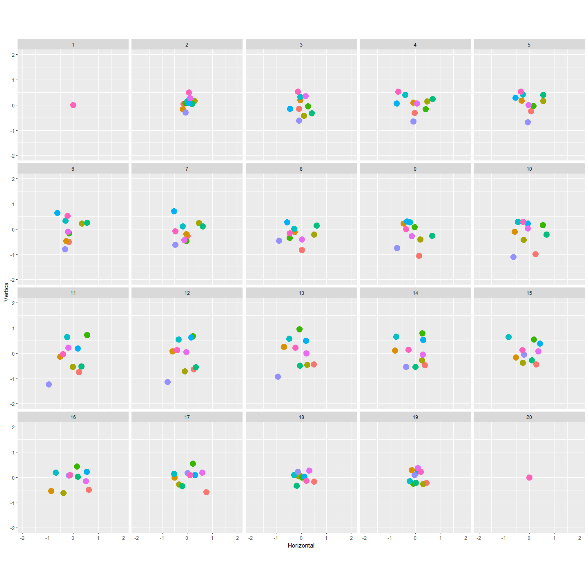
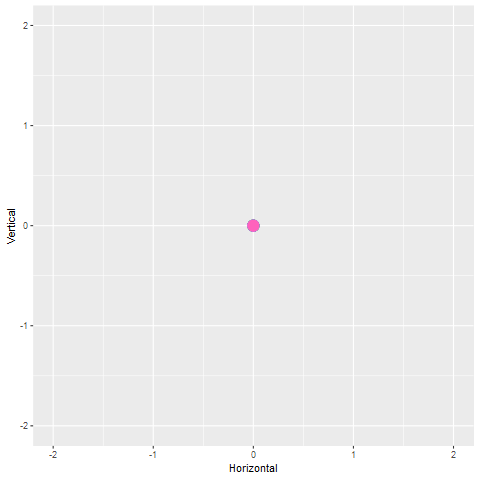
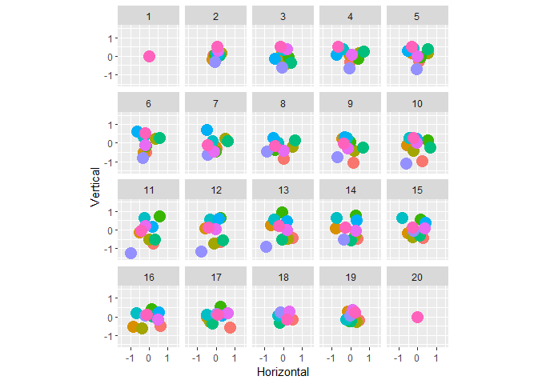

shadow\_mark
================
Danielle Navarro & Dale Maschette
22/11/2018

One of the nice features of gganimate is the ability to create *shadows*, in which previous states of the animation can remain visible at later states in the animation. There are four shadow functions, `shadow_wake()`, `shadow_trail()`, `shadow_mark()` and `shadow_null()`. In this walkthrough I'll discuss the `shadow_wake()` function.

Creating the animation
----------------------

To illustrate the flexibility of the function, I'll start by creating a two dimensional brownian bridge simulation using the `rbridge()` function from the `e1071` package:

``` r
ntimes <- 20  # how many time points to run the bridge?
nseries <- 10 # how many time series to generate?

# function to generate the brownian bridges
make_bridges <- function(ntimes, nseries) {
  replicate(nseries, c(0,rbridge(frequency = ntimes-1))) %>% as.vector()
}

# construct tibble
tbl <- tibble(
  Time = rep(1:ntimes, nseries),
  Horizontal = make_bridges(ntimes, nseries),
  Vertical = make_bridges(ntimes, nseries),
  Series = gl(nseries, ntimes)
)

glimpse(tbl)
```

    ## Observations: 200
    ## Variables: 4
    ## $ Time       <int> 1, 2, 3, 4, 5, 6, 7, 8, 9, 10, 11, 12, 13, 14, 15, ...
    ## $ Horizontal <dbl> 0.00000000, -0.14372375, -0.08999032, -0.03036065, ...
    ## $ Vertical   <dbl> 0.0000000, 0.0486486, -0.1488008, -0.3056080, -0.24...
    ## $ Series     <fct> 1, 1, 1, 1, 1, 1, 1, 1, 1, 1, 1, 1, 1, 1, 1, 1, 1, ...

We have a data frame with 10 separate time `Series`, each of which extends for 20 `Time` points, and plots the `Horizontal` and `Vertical` location of a particle that is moving along a Brownian bridge path. To see what the data looks like, here's a plot showing each time point as a separate facet:

``` r
base_pic <- tbl %>%
  ggplot(aes(
    x = Horizontal, 
    y = Vertical, 
    colour = Series)) + 
  geom_point(
    show.legend = FALSE,
    size = 5) + 
  coord_equal() + 
  xlim(-2, 2) + 
  ylim(-2, 2)

base_pic + facet_wrap(~Time)
```



We can now create a basic animation using `transition_time()`, in which we can see each of the points moving smoothly along the path.

``` r
base_anim <- base_pic + transition_time(time = Time) 
base_anim %>% animate()
```


Basic use of shadow mark
------------------------

``` r
mark1<- base_anim + 
  shadow_mark(size = 1, 
              alpha = 0.5,
              colour = "black"
  )
mark1 %>% animate(detail = 5, type = "cairo")
```



``` r
#Multi color mark
#Create a set of colors for us to use. Normally I would match them up (red with light red ect.) but for this example we wont. 
library(fields)
cols<-tim.colors(10)

#Assign each series their own color in the tbl, There is certainly a better way to do this; but I don't know it. 
tbl<-tbl %>% select(Time:Series) %>% mutate(col=case_when(
  Series== 1  ~ cols[1],
  Series== 2  ~ cols[2],
  Series== 3  ~ cols[3],
  Series== 4  ~ cols[4],
  Series== 5  ~ cols[5],
  Series== 6  ~ cols[6],
  Series== 7  ~ cols[7],
  Series== 8  ~ cols[8],
  Series== 9  ~ cols[9],
  Series== 10  ~ cols[10]))

#Arrange the tbl based on the time variable; this is so that the order of the color column matches the order gganimate will turn your data into. 
tbl<-tbl %>% arrange(Time)

#Redo the above
base_pic <- tbl %>%
  ggplot(aes(
    x = Horizontal, 
    y = Vertical, 
    colour = Series)) + 
  geom_point(
    show.legend = FALSE,
    size = 5) + 
  coord_equal() + 
  xlim(-1.5, 1.5) + 
  ylim(-1.5, 1.5)

base_pic + facet_wrap(~Time)
```



``` r
#Base Anim
base_anim <- base_pic + transition_time(time = Time) 

markcol <- base_anim + 
  shadow_mark(alpha=0.6, 
              colour=tbl$col, 
              size = 1.5)
markcol %>% animate()
```


