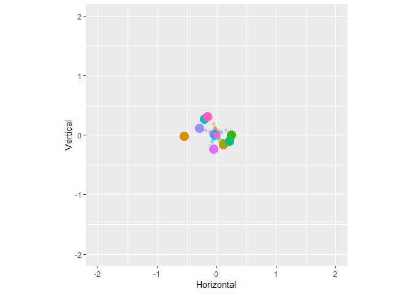

shadow\_wake
================
Danielle Navarro
22/11/2018

Create a two dimensional brownian bridge simulation

``` r
ntimes <- 20  # how many time points to run the bridge?
nseries <- 10 # how many time series to generate?

# function to generate the brownian bridges
make_bridges <- function(ntimes, nseries) {
  replicate(nseries, rbridge(frequency = ntimes)) %>% as.vector()
}

# construct tibble
tbl <- tibble(
  Time = rep(1:ntimes, nseries),
  Horizontal = make_bridges(ntimes, nseries),
  Vertical = make_bridges(ntimes, nseries),
  Series = gl(nseries, ntimes)
)

glimpse(tbl)
```

    ## Observations: 200
    ## Variables: 4
    ## $ Time       <int> 1, 2, 3, 4, 5, 6, 7, 8, 9, 10, 11, 12, 13, 14, 15, ...
    ## $ Horizontal <dbl> 0.11444869, 0.10564521, -0.19538845, -0.08763559, 0...
    ## $ Vertical   <dbl> -0.15717496, -0.29587616, -0.40380554, -0.39125342,...
    ## $ Series     <fct> 1, 1, 1, 1, 1, 1, 1, 1, 1, 1, 1, 1, 1, 1, 1, 1, 1, ...

Draw a picture so that you can see what each of the frames looks like:

``` r
base_pic <- tbl %>%
  ggplot(aes(
    x = Horizontal, 
    y = Vertical, 
    colour = Series,
    fill = Series)) + 
  geom_point(
    show.legend = FALSE,
    size = 5) + 
  coord_equal() + 
  xlim(-2, 2) + 
  ylim(-2, 2)

base_pic + facet_wrap(~Time)
```


Make the base animation using `transition_time()`

``` r
base_anim <- base_pic + transition_time(time = Time) 
base_anim
```


Now add some `shadow_wake()` because shadow wake is cool

``` r
wake1 <- base_anim + shadow_wake(wake_length = .1)
wake1
```



Yay!

The discrete look is a bit meh. If we want it to look like a continuous thing we can up the detail on the call to `animate()`. So instead of printing the `wake1` object let's explicitly pass it to animate and up the `detail`:

``` r
wake1 %>% animate(detail = 3)
```


This still looks janky. When I rendered this on Adam Gruer's Mac it worked beautifully, but I'm rendering this on a Windows machine and it looks garbage. To fix this we need to tinker with the rendering. Under the hood, each frame is being rendered with the `png()` graphics device and by default it's using the Windows GDI. Screw that let's use Cairo:

``` r
wake1 %>% animate(detail = 3, type = "cairo")
```


Aha!

Changing the length of the tail by changing `wake_length`. To make it 30% of the total animation

``` r
wake2 <- base_anim + shadow_wake(wake_length = .2)
wake2 %>% animate(detail = 3, type = "cairo")
```


At the moment the transparency of the trail is falling off as well as the size. So let's tell it to leave the size untouched and have the wake change only in transparency

``` r
wake3 <- base_anim + shadow_wake(wake_length = .1, size = NULL)
wake3 %>% animate(detail = 3)
```


Similarly we can turn off the transparency

``` r
wake4 <- base_anim + shadow_wake(wake_length = .1, size = NULL, alpha = NULL)
wake4 %>% animate(detail = 3)
```


