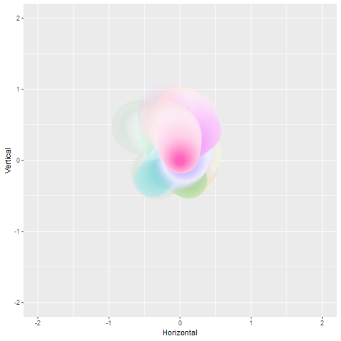
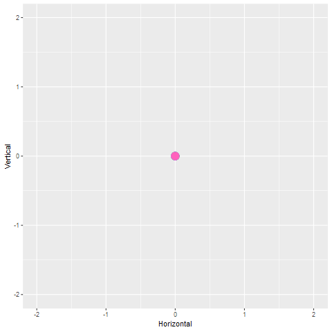
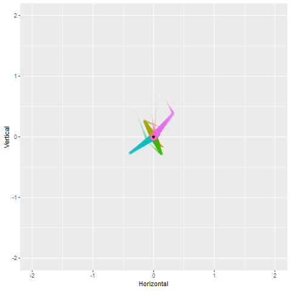

shadow\_wake
================
Danielle Navarro
22/11/2018

One of the nice features of gganimate is the ability to create *shadows*, in which previous states of the animation can remain visible at later states in the animation. There are four shadow functions, `shadow_wake()`, `shadow_trail()`, `shadow_mark()` and `shadow_null()`. In this walkthrough I'll discuss the `shadow_wake()` function.

Creating the animation
----------------------

To illustrate the flexibility of the function, I'll start by creating a two dimensional brownian bridge simulation using the `rbridge()` function from the `e1071` package:

``` r
ntimes <- 20  # how many time points to run the bridge?
nseries <- 10 # how many time series to generate?

# function to generate the brownian bridges
make_bridges <- function(ntimes, nseries) {
  replicate(nseries, c(0,rbridge(frequency = ntimes-1))) %>% as.vector()
}

# construct tibble
tbl <- tibble(
  Time = rep(1:ntimes, nseries),
  Horizontal = make_bridges(ntimes, nseries),
  Vertical = make_bridges(ntimes, nseries),
  Series = gl(nseries, ntimes)
)

glimpse(tbl)
```

    ## Observations: 200
    ## Variables: 4
    ## $ Time       <int> 1, 2, 3, 4, 5, 6, 7, 8, 9, 10, 11, 12, 13, 14, 15, ...
    ## $ Horizontal <dbl> 0.000000000, -0.049879825, 0.415680479, 0.537517639...
    ## $ Vertical   <dbl> 0.00000000, -0.15372441, -0.30528943, -0.52619625, ...
    ## $ Series     <fct> 1, 1, 1, 1, 1, 1, 1, 1, 1, 1, 1, 1, 1, 1, 1, 1, 1, ...

We have a data frame with 10 separate time `Series`, each of which extends for 20 `Time` points, and plots the `Horizontal` and `Vertical` location of a particle that is moving along a Brownian bridge path. To see what the data looks like, here's a plot showing each time point as a separate facet:

``` r
base_pic <- tbl %>%
  ggplot(aes(
    x = Horizontal, 
    y = Vertical, 
    colour = Series)) + 
  geom_point(
    show.legend = FALSE,
    size = 5) + 
  coord_equal() + 
  xlim(-2, 2) + 
  ylim(-2, 2)

base_pic + facet_wrap(~Time)
```


We can now create a basic animation using `transition_time()`, in which we can see each of the points moving smoothly along the path.

``` r
base_anim <- base_pic + transition_time(time = Time) 
base_anim %>% animate()
```


Basic use of shadow wake
------------------------

To see what `shadow_wake()` does, we'll add it to the animation. the one required argument to the function is `wake_length`, which governs how "long" the wake is. The `wake_length` is a value from 0 to 1, where 1 means "the full length of the animation":

``` r
wake1 <- base_anim + shadow_wake(wake_length = .1)
wake1 %>% animate()
```


Yay! We have shadows following along in the "wake" of each of our particles.

Tinkering with detail and graphics devices
------------------------------------------

There's a bit of subtlety to this that is worth noting. By default, the animation leaves a shadow from each previous frame. Because this is a 100 frame anumation (the gganimate default) and we asked for a `wake_length` of .1, it's leaving 10 dots behind each particle, and they fall off in size and transparency. That's a sensible default, but in many situations the interpolating frames in the animation aren't actually terribly meaningful in and of themselves, and you might want to have a "continuous" wake. To do this, the easiest solution is to increase the `detail` argument in the call to `animate()`. What this does is increase the number of interpolated frames between successive states of the anumation. So if I set `detail = 5` the animation won't actually include any extra frames in the output, but the shadow wake will be computed as if there had been 5 additional frames between each "actual" frame:

``` r
wake1 %>% animate(detail = 5)
```


This is getting closer to something worthwhile, but it still looks a bit janky. When I rendered this on Adam Gruer's Mac it worked beautifully, but I'm rendering this on my Windows machine and it looks like garbage for some reason. Something odd is going on here. To fix this we need to tinker with the rendering. Under the hood, each frame is being rendered with the `png()` graphics device and by default on my machine it using the Windows GDI as the graphics device. Let's use Cairo instead:

``` r
wake1 %>% animate(detail = 5, type = "cairo")
```


Much nicer!

Changing length, size and transparency
--------------------------------------

Changing the length of the tail by changing `wake_length`. To make it 20% of the total animation

``` r
wake2 <- base_anim + shadow_wake(wake_length = .2)
wake2 %>% animate(detail = 5, type = "cairo")
```


At the moment the transparency of the trail is falling off as well as the size. So let's tell it to leave the size untouched and have the wake change only in transparency

``` r
wake3 <- base_anim + shadow_wake(wake_length = .1, size = NULL)
wake3 %>% animate(detail = 5, type = "cairo")
```


Similarly we can turn off the transparency

``` r
wake4 <- base_anim + shadow_wake(wake_length = .1, size = NULL, alpha = NULL)
wake4 %>% animate(detail = 5, type = "cairo")
```


Colour and fill
---------------

We can set it so that the `colour` and `fill` end up at a certain value. For example, to have the trails fade to black:

``` r
wake5 <- base_anim + 
  shadow_wake(wake_length = .1, 
              size = NULL, 
              alpha = NULL,
              colour = "black"
              )
wake5 %>% animate(detail = 5, type = "cairo")
```


Easing functions on the shadow wake
-----------------------------------

At the moment the colour isn't changing linearly. We can do that by changing the `falloff` argument. By default it uses a the "cubic-in" easing function, but we can make it "linear":

``` r
wake6 <- base_anim + 
  shadow_wake(wake_length = .1, 
              size = NULL, 
              alpha = NULL,
              colour = "black",
              falloff = "linear"
              )
wake6 %>% animate(detail = 5, type = "cairo")
```


Changing the easing function on the falloff can produce suprising variations. This is "bounce-out"

``` r
wake7 <- base_anim + 
  shadow_wake(wake_length = .1, 
              size = NULL, 
              alpha = NULL,
              colour = "black",
              falloff = "bounce-out"
              )
wake7 %>% animate(detail = 5, type = "cairo")
```


Playing with the combinations produces other variations,

``` r
wake8 <- base_anim + 
  shadow_wake(wake_length = .3, 
              size = 15, 
              colour = "white",
              falloff = "quintic-in"
              )
wake8 %>% animate(detail = 5, type = "cairo")
```



To wrap or not to wrap the shadows
----------------------------------

The other arguments to the function allow flexiblity in other ways. In this simulation it makes sense to "wrap" the shadow wake (i.e., allow shadows from the end of the animation to appear at the beginning) because the time series' are all designed to be cyclic: they end at the same state that they started. Sometimes that's undesirable (wrapping a shadow from 1977 onto a data point from 2018 is a bit weird since time is thankfully not a loop), so you can turn this off by setting `wrap = FALSE`.

This can also produce interesting effects!

``` r
wake9 <- base_anim + 
  shadow_wake(wake_length = .3, 
              size = 15, 
              colour = "white",
              falloff = "quintic-in",
              wrap = FALSE
              )
wake9 %>% animate(detail = 5, type = "cairo")
```



Controlling which layers leave shadows
--------------------------------------

When the base plot has multiple layers, you can control which layers get shadow wake and which don't. Let's create a plot with multiple layers:

``` r
newanim <- base_pic + 
  geom_point(colour = "black", size = 1, show.legend = FALSE) + 
  transition_time(time = Time) + 
  shadow_wake(wake_length = .2)
  
newanim %>% animate(detail = 5, type = "cairo")
```


This is really cool, but perhaps that's not what I want. I've constructed a plot with two layers, and maybe I only want to add shadow wake to the first one.

``` r
newanim$layers
```

    ## [[1]]
    ## geom_point: na.rm = FALSE
    ## stat_identity: na.rm = FALSE
    ## position_identity 
    ## 
    ## [[2]]
    ## geom_point: na.rm = FALSE
    ## stat_identity: na.rm = FALSE
    ## position_identity

So let's suppose I want to exclude the second layer (the black dots I added over the top of the coloured ones). I can do this by setting `exclude_later = 2`:

``` r
newanim2 <- base_pic + 
  geom_point(colour = "black", size = 1, show.legend = FALSE) + 
  transition_time(time = Time) + 
  shadow_wake(wake_length = .2, exclude_layer = 2)
  
newanim2 %>% animate(detail = 5, type = "cairo")
```



Yay!
