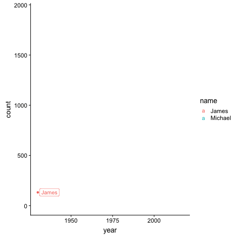
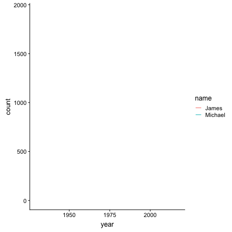
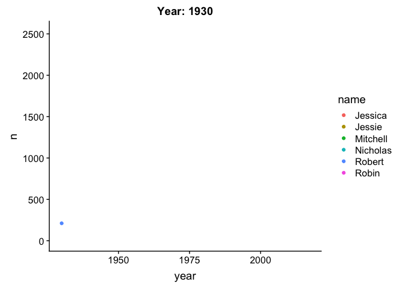
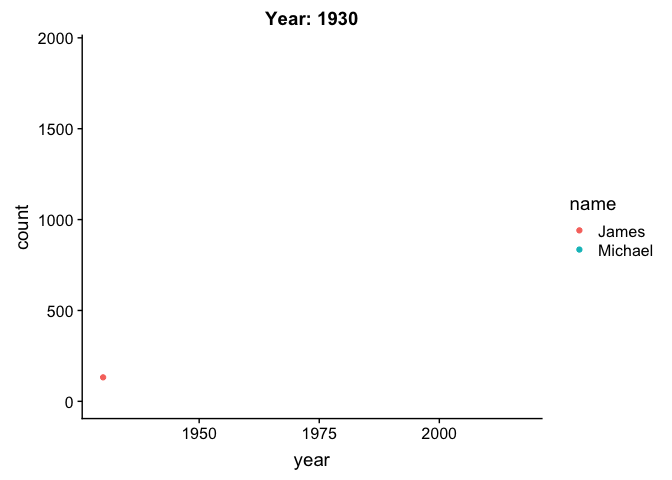

transition\_components
================
Anna Quaglieri
22/11/2018

-   [Example with US flights](#example-with-us-flights)
-   [Example with babynames](#example-with-babynames)
-   [What are the differences between `transition_reveal` and `transition_component`?](#what-are-the-differences-between-transition_reveal-and-transition_component)

``` r
library(gganimate)
library(tidyverse)
library(fivethirtyeight)
library(emo)
devtools::install_github("hadley/emo")
devtools::install_github("ropenscilabs/icon")
library(icon)
# List all the transitions
#ls("package:gganimate")
```

To understand how `transition_component` works I will use the `US_births_1994_2003` dataset from the `fivethirtyeight` package. The title of the article where this data was used is *Some People Are Too Superstitious To Have A Baby On Friday The 13th*. Is that true?

``` r
head(US_births_1994_2003)
```

    ## # A tibble: 6 x 6
    ##    year month date_of_month date       day_of_week births
    ##   <int> <int>         <int> <date>     <ord>        <int>
    ## 1  1994     1             1 1994-01-01 Sat           8096
    ## 2  1994     1             2 1994-01-02 Sun           7772
    ## 3  1994     1             3 1994-01-03 Mon          10142
    ## 4  1994     1             4 1994-01-04 Tues         11248
    ## 5  1994     1             5 1994-01-05 Wed          11053
    ## 6  1994     1             6 1994-01-06 Thurs        11406

Some key points to keep in mind:

You need **id** and **time** components. The `transition_component` function is useful when you have the same subject (a plane, a day, a person, a neighborood etc..) with multiple observation over time.

The first thing to keep in mind

``` r
library(ggrepel)

fridays <- US_births_1994_2003 %>% 
  filter(day_of_week %in% c("Fri") & date_of_month %in% c(1,2,3,13,18,28))
table(fridays$date_of_month)
```

    ## 
    ##  1  2  3 13 18 28 
    ## 17 16 17 16 17 19

``` r
p=ggplot(fridays) + 
  geom_point(aes(x=year,y=births,colour=date_of_month)) +
  facet_wrap(~date_of_month)+
  transition_components(id=factor(date_of_month),time=date)+
  shadow_trail(distance = 0.01, size = 0.3)

animate(p, 200, 10,duration=20)
```


Example with US flights
=======================

Failed example!

Example with babynames
======================

`shadow_trail` allows you to customise the way in which your observation leaves a trace of themself once they move on:

-   `distance` let's you specify the distance between each trace left. I noticed that it does not work with a very small distance (0.001 wasn't working). It has something to do with the fact that `distance` is used a denominator at some steps and probably it gets too small
-   `size` works like in the normal `ggplot()` (e.g. size of dots)

``` r
library(devtools)
install_github("ropenscilabs/ozbabynames")
library(ozbabynames)
library(gganimate)

p=ggplot(ozbabynames[ozbabynames$name %in% c("Michael","James"),]) + 
  geom_point(aes(x=year,y=count,colour=name)) +
  theme_bw() + 
  transition_components(id=name,time=year)+
  shadow_trail(distance = 0.1, size = 2)
# leaves a trail after 0.1
p
```


``` r
p=ggplot(ozbabynames[ozbabynames$name %in% c("Michael","James"),]) + 
  geom_point(aes(x=year,y=count,colour=name)) +
  transition_components(id=name,time=year)+
  shadow_trail(distance = 2, size = 2)
p
```


``` r
p=ggplot(ozbabynames[ozbabynames$name %in% c("Michael","James"),]) + 
  geom_point(aes(x=year,y=count,colour=name)) +
  transition_components(id=name,time=year)+
  shadow_trail(distance = 0.001, size = 2)
# Error in seq.default(1, params$nframes, by = params$distance) : 
# invalid '(to - from)/by'
# 
p
```

-   Just an alternative with `transition_reveal`

``` r
p2=ggplot(ozbabynames[ozbabynames$name %in% c("Michael","James"),]) + 
  geom_point(aes(x=year,y=count,colour=name,group=name)) +
  geom_line(aes(x=year,y=count,colour=name,group=name)) +
  geom_label_repel(aes(x=year,y=count,colour=name,label=name,group=name),
    arrow = arrow(length = unit(0.03, "npc"), type = "closed", ends = "first"),
    force = 10)+
  transition_reveal(id=name,along=year,keep_last = FALSE)+
  shadow_trail(distance = 0.01, size = 2,exclude_layer=3)
animate(p2,nframes = 100,duration = 30)
```



What are the differences between `transition_reveal` and `transition_component`?
================================================================================

It look like they do sort of the same things...

But!

-   **geom\_line()** with `transition_component()` throws and error: `Error: Unsupported layer type`

``` r
library(ggrepel)
p=ggplot(ozbabynames[ozbabynames$name %in% c("Michael","James"),]) + 
  geom_point(aes(x=year,y=count,colour=name)) +
  geom_line(aes(x=year,y=count,colour=name,group=name)) +
  transition_components(id=name,time=year)+
  shadow_trail(distance = 2, size = 2)
animate(p,nframes = 20)
```

``` r
p2=ggplot(ozbabynames[ozbabynames$name %in% c("Michael","James"),]) + 
  geom_line(aes(x=year,y=count,colour=name,group=name)) +
  transition_reveal(id=name,along=year,keep_last = FALSE)+
  shadow_trail(distance = 0.01, size = 2)
animate(p2,nframes = 100,duration = 10)
```



-   In order to show the transition across time you use `{frame_along}` from `transition_reveal` and `{frame_time}` in `transition_components`...

``` r
library(tidyverse)
author_names <- c("Robin", "Robert", "Mitchell", "Nicholas", "Jessie", "Jessica")

dat <- ozbabynames %>%
  filter(name %in% author_names) %>%
  count(name,year, wt = count) 

p2=ggplot(dat) + 
  geom_point(aes(x=year,y=n,colour=name)) +
  transition_components(id=name,time=year)+
  shadow_trail(distance = 0.01, size = 2)+
  labs(title="Year: {frame_time}")
p2
```



``` r
p2=ggplot(dat) + 
  geom_point(aes(x=year,y=n,colour=name)) +
  transition_components(id=name,time=year)+
  shadow_trail(distance = 0.01, size = 2)+
  labs(title="Year: {frame_time}")
p2
```


