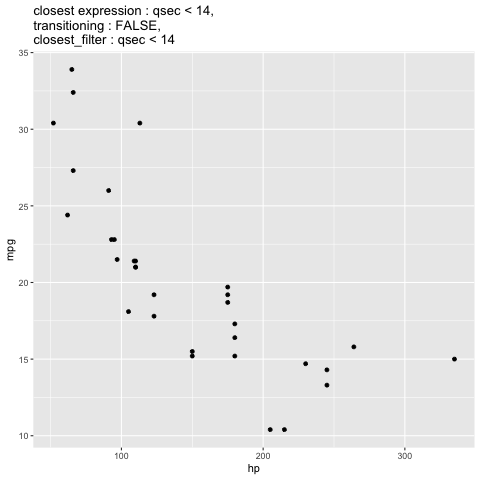
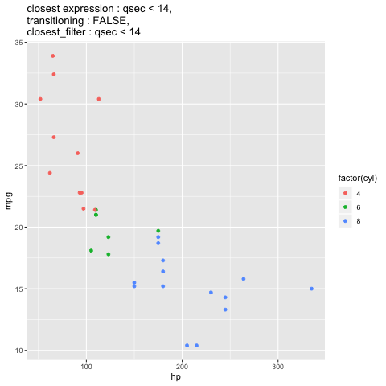
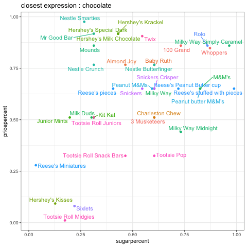
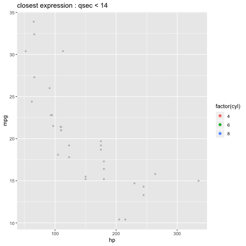

transition\_filter
================
Anna Quaglieri
22/11/2018

-   [How do the filtering functions actually work?](#how-do-the-filtering-functions-actually-work)
-   [Let's investigate the `keep` argument.](#lets-investigate-the-keep-argument.)
-   [How does the `wrap` argument work?](#how-does-the-wrap-argument-work)
-   [Errors encountered along the way](#errors-encountered-along-the-way)

``` r
devtools::install_github("thomasp85/gganimate")
devtools::install_github("thomasp85/transformr")
```

``` r
library(tidyverse)
library(gganimate)
library(transformr)
library(emo)
```

This is what the help function tells us `transition_filter` does.

``` r
?transition_filter
```

> Transition between different filters
> ------------------------------------
>
> This transition allows you to transition between a range of filtering conditions. The conditions are expressed as logical statements and rows in the data will be retained if the statement evaluates to TRUE. It is possible to keep filtered data on display by setting keep = TRUE which will let data be retained as the result of the exit function. Note that if data is kept the enter function will have no effect.

> Usage
> -----
>
> transition\_filter(transition\_length, filter\_length, ..., wrap = TRUE, keep = FALSE)

Let's start simple!! I believe that's where all big things start...

-   This is how a simple xy plot showing `hp` vs `mpg` from the `mtcars` data frame looks like using `ggplot() + geom_point()`

``` r
mydf <- mtcars
p1=ggplot(mydf, aes(x = hp, y = mpg)) +
geom_point()
p1
```


-   Let's add `transition_filter()`

``` r
p1 + transition_filter(transition_length = 10, 
                       filter_length = 0.2, 
                       wrap = TRUE, 
                       keep = FALSE,
                       qsec < 15,  qsec > 16) +
  labs(title="{closest_expression}")
```


To figure out what's happening at different stages of the transition you can ask `gganimate` to output the filters that are applied at different stages of the animation. This was achieved in the code above by setting the title to `{closest_expression}`. Every `gganimate` function has its own options which you can find listed in the **`Label variables`** section of a function's help page. For example these are three out of the **`Label variables`** for `gganimate::transition_filter`.

> Label variables
> ---------------

> -   **transition\_filter** makes the following variables available for string literal interpretation
> -   **transitioning** is a boolean indicating whether the frame is part of the transitioning phase
> -   **previous\_filter** The name of the last filter the animation was at

How do the filtering functions actually work?
---------------------------------------------

`transition_filter()` requires at least two logical conditions that it will use to produce the different instances of the animation. For example, in the example below `transition_filter()` will plot first `hp` vs `mpg` only for rows that satisfies `qsec < 15` and then it will plot `hp` vs `mpg` only for rows that satisfies `qsec > 16`. You can add as many conditions as you like!

Below I ran `transition_filter()` with three filters and added several `Label variables` to the title to give an idea about which filters are used at each state.

``` r
p1 + transition_filter(transition_length = 10, 
                       filter_length = 0.2, 
                       wrap = TRUE, 
                       keep = FALSE,
                       qsec < 14,  qsec > 16, qsec > 20) + 
  labs(title = "closest expression : {closest_expression}, \n transitioning : {transitioning}, \n closest_filter : {closest_filter}")
```


You can also provide a `TRUE\FALSE` column from your data frame as the logical condition!!!

``` r
mydf <- mydf %>% mutate(cond1 = qsec < 15,
                        cond2 = qsec > 15 & qsec < 20,
                        cond3 = qsec > 20)

# update ggplot plot
p1=ggplot(mydf, aes(x = hp, y = mpg)) +
geom_point()

head(mydf[,c("cond1","cond2","cond3")])
```

    ##   cond1 cond2 cond3
    ## 1 FALSE  TRUE FALSE
    ## 2 FALSE  TRUE FALSE
    ## 3 FALSE  TRUE FALSE
    ## 4 FALSE  TRUE FALSE
    ## 5 FALSE  TRUE FALSE
    ## 6 FALSE FALSE  TRUE

``` r
p1 + transition_filter(transition_length = 10, 
                       filter_length = 0.2, 
                       wrap = TRUE, 
                       keep = FALSE,
                       cond1,cond2,cond3) + 
  labs(title = "closest expression : {closest_expression}")
```



Let's investigate the `keep` argument.
--------------------------------------

In the previous examples `keep` has always been `FALSE`. To make things a little bit exciting I will set it now to `TRUE`.

``` r
g=ggplot(mtcars, aes(x = hp, y = mpg, colour = factor(cyl))) +
geom_point() + transition_filter(transition_length = 10, 
                            filter_length = 0.2, 
                            wrap = TRUE, 
                            keep = TRUE,
                            qsec < 14,qsec > 16,qsec > 20) + 
  labs(title = "closest expression : {closest_expression}, \n transitioning : {transitioning}, \n closest_filter : {closest_filter}")

animate(g, nframes = 10, fps = 2)
```



Great! But... now I cannot really see what's being filtered at each stage.

Thanks to the `gganimate` 📦 author Thomas for helping with understanding `keep` in this [issue](https://github.com/thomasp85/gganimate/issues/220#issuecomment-441178296).

Normally, you would set `keep = TRUE` if you are interested in seeing how the filters modify your selection with respect to the whole background of observations (which comprises observations that would normally be excluded by the logical condition). The argument `keep` becomes useful in combination with an exit function **that does not make the observations disappear**. If you are not familar with exit functions you can find some examples [here](https://github.com/ropenscilabs/learngganimate/blob/master/enter_exit/enter_exit.md). In general, the exit function will do something, that you choose, to the observations that should be exiting a transition. The example below is adapted from this [issue](https://github.com/thomasp85/gganimate/issues/220#issuecomment-441178296).

``` r
g=ggplot(mtcars, aes(x = hp, y = mpg, colour = factor(cyl))) + 
  geom_point(size = 2) + 
  transition_filter(transition_length = 10, 
                            filter_length = 0.2, 
                            wrap = TRUE, 
                            keep = TRUE,
                            qsec < 14,qsec > 16,qsec > 20) + 
  labs(title = "closest expression : {closest_expression}") +
  exit_manual(function(x) dplyr::mutate(x, colour = "grey",size= 1))

animate(g, nframes = 30, fps = 2)
```



In the example above, all the observations are always plotted, and by using the `exit_manual` function we can change the appearance of the observations that should actually be filtered out and highlight the ones that stay in!

On a different note, it is really interesting what happens with the code: `dplyr::mutate(x, colour = "grey",size= 1)`! The exter/exit functions receive the data with enter/exit the animations and they are stored in the standard data frame object. This means that we could use the `dplyr::mutate()` function to specify how we want to modify the entering/exiting data!

How does the `wrap` argument work?
----------------------------------

`wrap` is a common argument to different `gganimate()` functions and it is pretty self explanatory:

> **wrap** Should the animation wrap-around? If TRUE the last filter will be transitioned into the first.

When setting below, you can see that the transition between `qsec > 20` (last condition) and `qsec < 14` (first condition) happens with a sort of "*jump*". Whereas when setting `wrap = TRUE` the transition between the last and first condition is wrapped and happens in the same way as between the other ones, like in a cycle.

``` r
g=ggplot(mtcars, aes(x = hp, y = mpg, colour = factor(cyl))) + 
  geom_point(size = 2) + 
  transition_filter(transition_length = 10, 
                            filter_length = 0.2, 
                            wrap = FALSE, 
                            keep = TRUE,
                            qsec < 14,qsec > 16,qsec > 20) + 
  labs(title = "closest expression : {closest_expression}") +
  exit_manual(function(x) dplyr::mutate(x, colour = "grey",size= 1))

animate(g, nframes = 30, fps = 2)
```



``` r
g=ggplot(mtcars, aes(x = hp, y = mpg, colour = factor(cyl))) + 
  geom_point(size = 2) + 
  transition_filter(transition_length = 10, 
                            filter_length = 0.2, 
                            wrap = TRUE, 
                            keep = TRUE,
                            qsec < 14,qsec > 16,qsec > 20) + 
  labs(title = "closest expression : {closest_expression}") +
  exit_manual(function(x) dplyr::mutate(x, colour = "grey",size= 1))

animate(g, nframes = 30, fps = 2)
```


Errors encountered along the way
--------------------------------

If you ever get: `Error in transform_path(all_frames, next_filter, ease, params$transition_length[i],transformr is required to tween paths and lines` install the package `transformr`.
