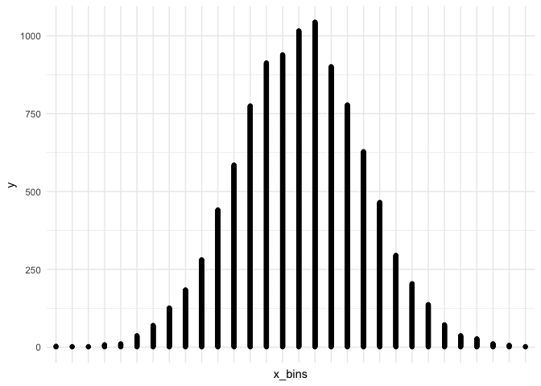

transistion\_layers
================
Adam Gruer + Saskia Freytag
22/11/2018

transistion\_layers()
=====================

what do I think it will do?
---------------------------

I think it will add a frame for each geom\_ I add to the plot.

What does the help say
======================

``` r
?transition_layers
```

> Build up a plot, layer by layer
> -------------------------------
>
> This transition gradually adds layers to the plot in the order they have been defined. By default prior layers are kept for the remainder of the animation, but they can also be set to be removed as the next layer enters.

> Usage
> -----

> transition\_layers(layer\_length, transition\_length, keep\_layers = TRUE, from\_blank = TRUE, layer\_names = NULL)

First attempt
=============

add three layers geom\_point and geom\_histogram and a geom\_bar It did do as I expected.

I still struggle to understand the layer\_length and transition\_length beyond them being relative times

``` r
 ggplot(mtcars ) + 
  geom_point(aes(disp, mpg), colour = "purple", size = 3)  +
  geom_histogram(aes(disp)) +
  geom_bar(aes(cyl))+
  transition_layers(layer_length = 1, transition_length = 1, keep_layers = TRUE)
```

    ## `stat_bin()` using `bins = 30`. Pick better value with `binwidth`.


It is very literal. `ggplot(mtcars)` is a layer albeit an uninteresting one. However one of the arguments `from_blank` which defaults to TRUE can be changed to FALSE so as to not show this first layer.

Here i show the effect of not showing the first 'blank' layer.

``` r
 ggplot(mtcars ) + 
  geom_point(aes(disp, mpg), colour = "purple", size = 3)  +
  geom_histogram(aes(disp)) +
    geom_bar(aes(cyl))+
  transition_layers(layer_length = 1, transition_length = 1, keep_layers = TRUE, from_blank =  FALSE ) 
```

    ## `stat_bin()` using `bins = 30`. Pick better value with `binwidth`.


I can choose not to keep each layer as I animate by setting `keep_layers = FALSE`

``` r
 ggplot(mtcars ) + 
  geom_point(aes(disp, mpg), colour = "purple", size = 3)  +
  geom_histogram(aes(disp)) +
    geom_bar(aes(cyl))+
  transition_layers(layer_length = 1, transition_length = 1, keep_layers = FALSE, from_blank =  FALSE ) 
```

    ## `stat_bin()` using `bins = 30`. Pick better value with `binwidth`.


I can supply layer names to be used as label literals

``` r
ggplot(mtcars ) + 
  geom_point(aes(disp, mpg), colour = "purple", size = 3)  +
  geom_histogram(aes(disp)) +
    geom_bar(aes(cyl)) +
  labs(title = "{closest_layer}") +
  transition_layers(layer_length = 1, transition_length = 1, keep_layers = FALSE, from_blank =  FALSE, layer_names  = c("geom_point(disp,mpg)",
                                                                                                                        "geom_histogram(disp)",
                                              "geom_bar(cyl)")
                    ) 
```

    ## `stat_bin()` using `bins = 30`. Pick better value with `binwidth`.


Simulate some stuff
-------------------

In the next bit, we simulate a density and show which points we sample. Then we show what distribution they would form. To do this we can set the parameter `keep_layers = TRUE` and pass `layer_length` a vector of times we want to see each layer for.

``` r
sim <- data.frame(x = rnorm(10000, 0, 1), 
  sampled = sample(c("TRUE", rep("FALSE", 9)), 10000, replace = TRUE),
  index= 1:10000)

sim <- sim %>% mutate(x_bins =cut(x, 30)) %>% mutate(x_bins2 = as.numeric(x_bins))
sim <- sim[order(sim$x_bins2), ]
sim$y <- 1
sim$y <- unlist(lapply(split(sim$y, sim$x_bins2), cumsum)) 

sim_1 <- sim %>% filter(sampled==TRUE)
sim_1 <- sim_1[order(sim_1$x_bins2), ]
sim_1$y_1 <- 1
sim_1$y_1 <- unlist(lapply(split(sim_1$y_1, sim_1$x_bins2), cumsum)) 

ggplot(sim, aes(x_bins, y)) + geom_point() + 
  geom_point(data=sim_1, aes(x_bins, y), col="grey") +
  geom_point(data=sim_1, aes(x_bins, y_1), col="hotpink") +
  theme(axis.text.x = element_blank()) +
   transition_layers(layer_length = c(1, 2, 2), transition_length = 1, 
                     keep_layers = TRUE, from_blank = FALSE, 
                     layer_names  = c("Density", rep("Sampled", 2))) 
```


