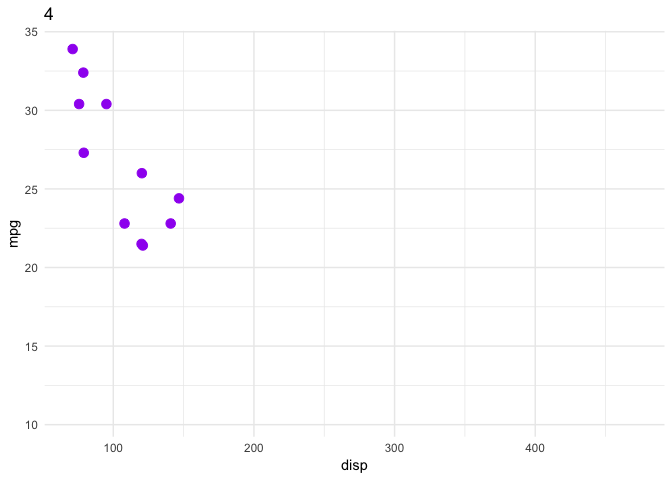
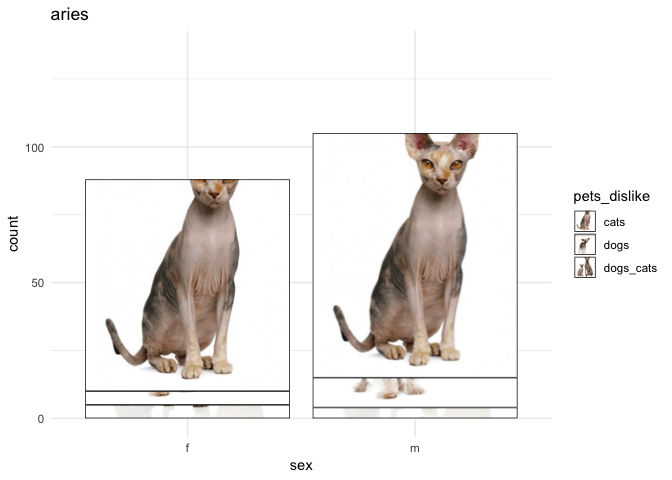
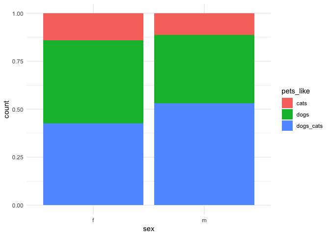

transition\_manual
================
Adam Gruer + Saskia Freytag
22/11/2018

Explain transistion\_manual
---------------------------

A static plot

``` r
cars_plot <- ggplot(mtcars, aes(disp, mpg), ) + 
  geom_point(colour = "purple", size = 3) 
cars_plot
```


Facet by cylinder

``` r
cars_plot + facet_wrap(~cyl)
```


Animate
-------

Transition manual will show one frame per level of the supplied variable. the `{current_frame}` can be used anywhere that accepts a string (I think!) to display the value of the 'frame' variable at each step of the animation.

``` r
cars_plot + transition_manual(cyl) +
  labs(title = "{current_frame}")
```

    ## nframes and fps adjusted to match transition



More complex example
--------------------

In this example we will be using the `okcupiddata` package to visualize how feelings about pets change with star sign. First let's begin with some data wrangling.

``` r
data(profiles)
profiles_red <- profiles %>% select(pets, sex, status, sign)

profiles_red <- profiles_red %>% mutate(sign = str_extract(sign, "[a-z']+[[:space:]]"))
profiles_red <- profiles_red %>% 
  mutate(pets_dislike = case_when(
    str_detect(pets, "dislikes dogs and dislikes cats") ~ "dogs_cats",
    str_detect(pets, "dislikes dogs") ~ "dogs", 
    str_detect(pets, "dislikes cats") ~ "cats"))
profiles_red <- profiles_red %>% mutate(sign = gsub(" ", "", sign))
profiles_red <- profiles_red %>% 
  mutate(pets_like = case_when(
    str_detect(pets, "likes dogs and likes cats") ~ "dogs_cats",
    str_detect(pets, "likes dogs") ~ "dogs", 
    str_detect(pets, "likes cats") ~ "cats"))
profiles_red <- profiles_red %>% 
  mutate(pets_has = case_when(
    str_detect(pets, "has dogs and has cats") ~ "dogs_cats",
    str_detect(pets, "has dogs") ~ "dogs", 
    str_detect(pets, "has cats") ~ "cats"))

# define factor
profiles_red <- profiles_red %>% filter(!is.na(sign))
profiles_red <- profiles_red %>% 
  mutate(sign = factor(sign, levels=c("aries", "taurus", "gemini", "cancer",
                                      "leo", "virgo", "libra", "scorpio",
                                      "sagittarius", "capricorn", "aquarius",
                                      "pisces"))) 
```

``` r
profiles_red2 <- profiles_red %>% filter(!is.na(pets_dislike))

images = c(
 dogs= "https://www.doggroomingtutorial.com/wp-content/uploads/2013/03/hairless-dogs.jpg",
 cats= "https://cf.ltkcdn.net/cats/images/std/143224-306x425-Full-shot-of-Sphynx-cat.jpg",
 dogs_cats = "https://us.123rf.com/450wm/fotojagodka/fotojagodka1704/fotojagodka170400004/76409120-canadian-sphynx-cat-and-thai-ridgeback-dog-in-front-of-white-background.jpg?ver=6"
)

dislike_plot <- ggplot(profiles_red2, aes(sex, image = pets_dislike)) +
  geom_textured_bar() +
  scale_image_manual(values = images)

dislike_plot + transition_manual(sign) + labs(title="{current_frame}")
```

    ## nframes and fps adjusted to match transition



``` r
profiles_red3 <- profiles_red %>% filter(!is.na(pets_like))
like_plot <- ggplot(profiles_red3, aes(x = sex)) + geom_bar(aes(fill=pets_like), position="fill") 
like_plot + transition_manual(sign)
```

    ## nframes and fps adjusted to match transition

``` r
images = c(
 dogs= "https://www.akc.org/wp-content/themes/akc/component-library/assets//img/welcome.jpg",
 cats= "https://encrypted-tbn0.gstatic.com/images?q=tbn:ANd9GcS2WhOti17crdhQ5YaH0tWnaPwy-EL7rVEWpyH_VABFAmjfA8mZKA",
 dogs_cats = "https://www.southernmallee.sa.gov.au/webdata/resources/images/Cat_and_Dog.jpg"
)

like_plot <- ggplot(profiles_red3, aes(sex, image = pets_like, class=pets_like)) +
  geom_textured_bar(position="fill") +
  scale_image_manual(values = images)

like_plot + transition_manual(sign) + labs(title="{current_frame}")
```

    ## nframes and fps adjusted to match transition


