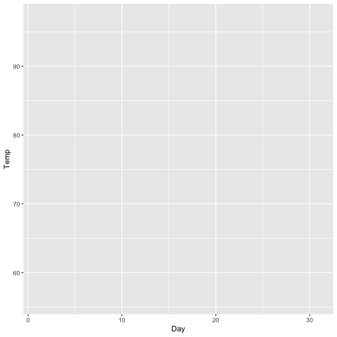
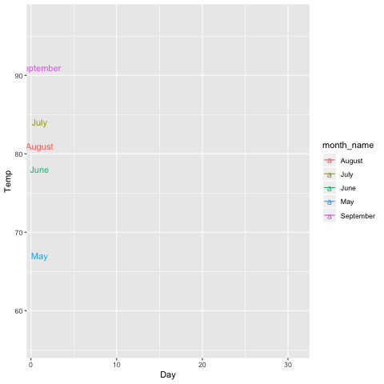

transition\_reveal
================
Robbie Bonelli
22/11/2018

What does `transition_reveal()` do?
===================================

> transition\_reveal() allows you to let data gradually appear, based on a given time dimension.

The function needs two simple paramteres, **id** and **along**.

Look at this plot

``` r
p <- ggplot(airquality, aes(Day, Temp, group = Month)) +
  geom_line()

p
```


We can try to track down each month's (**id**) temperature along the day (**along**)

``` r
p <- ggplot(airquality, aes(Day, Temp, group = Month)) +
  geom_line()+
  transition_reveal(id=Month, along=Day)

animate(p,nframes = 50)
```



We can try to visualise how all months move by also tacking them down

``` r
airquality$month_name <- rep(c("May","June","July","August","September"),c(31, 30, 31 ,31 ,30 ))


p <- ggplot(airquality, aes(Day, Temp, group = Month,color=month_name)) +
  geom_line()+
  geom_text(aes(label=month_name))+
  transition_reveal(id=Month, along=Day, range =,keep_last = F)

animate(p,nframes = 50)
```


