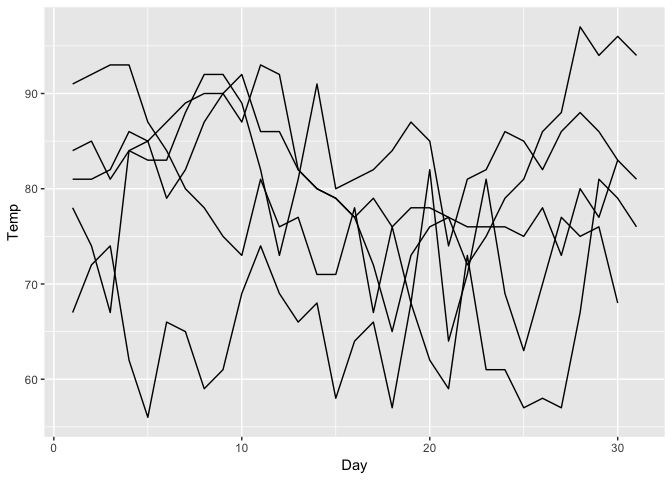
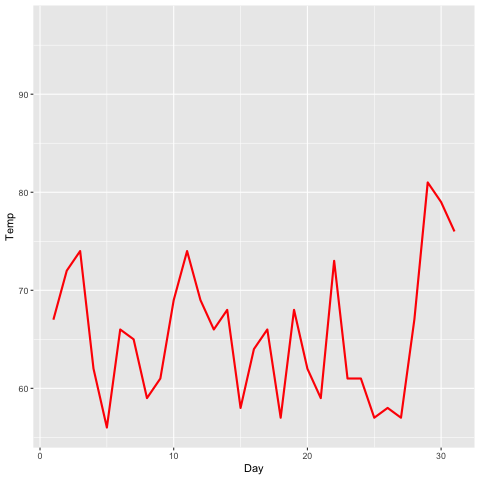

transition\_time
================
Robbie Bonelli
22/11/2018

What does `transition_time()` do?
=================================

> transition\_time() allows you to let data gradually appear, based on a given time dimension.

The function needs one simple paramteres, **time**.

Look at this plot

``` r
p <- ggplot(airquality, aes(Day, Temp, group = Month)) +
  geom_line()

p
```



We can try to track down each time series of Day Temp(eratures) along thes Months (**time**)

``` r
p <- ggplot(airquality, aes(Day, Temp)) +
   geom_line(color = 'red', size = 1) +
   transition_time(time=Month)
 
 animate(p,nframes = 50)
```



We can try to visualise how all months move by also tacking them down

``` r
airquality$month_name <- rep(c("May","June","July","August","September"),c(31, 30, 31 ,31 ,30 ))


p <- ggplot(airquality, aes(Day, Temp)) +
  geom_line() +
  geom_text(aes(x=1,y=max(Temp),label=month_name),hjust = 0,data=airquality[airquality$Day==1,])+
  transition_time(time=Month)

animate(p,nframes = 50)
```


