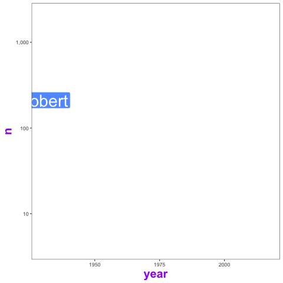
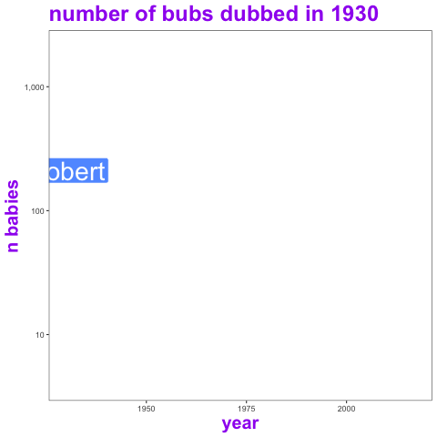

Difference between transition\_time and transition\_reveal
================
Robbie Bonelli
23/11/2018

**Build the plot**

``` r
p1 <-   ggplot(aes(x = year, 
             y = n,
             group = name),data=dat) +
  geom_label(aes(label = name,fill = name),colour = "white", size =  10) +
  theme_bw() +
  theme(panel.grid = element_blank(),
        legend.position = "none",
        title = element_text(colour = "purple",
                             size = 20,
                             face = "bold")
  ) +
  scale_y_log10(labels = scales::comma)
```

# `transition_time()` leaves a lot of “dirt” behind

``` r
p <- p1+transition_time(time = year)

animate(p,nframes = 50)
```

<!-- -->

### This can be solved by increasing the number of frames (possibly that’s why the default is 100 frames)

``` r
animate(p,nframes = 100)
```

<!-- -->

# `tansition_reveal()` does not leave anything behind, even with a low number of frames

``` r
p <- p1+transition_reveal(id = name, along = year)

animate(p,nframes = 50)
```

<!-- -->

# `tansition_reveal()` can track down the trajctory with a line

In contrast, `transition_time()` will return oy’s of warning error. It
is probably because transition time is meant to show ony one data point
per id (??)

``` r
p2 <- p1  + geom_line(aes(colour = name),size = 1, linetype = "dotted") 


p <- p2 + transition_reveal(id = name, along = year)


animate(p,nframes = 50)
```

<!-- -->

# `tansition_reveal()` and `tansition_time()` need a different parameter that needs to be passed for the label of the frame.

### **frame\_along** for `tansition_reveal()` and **frame\_time** for `transition_time()` and

``` r
p2 <- p1  + labs( title = "number of bubs dubbed in {frame_along} ", y = "n babies" ) 


p <- p2 + transition_reveal(id = name, along = year)


animate(p,nframes = 50)
```

<!-- -->

``` r
p2 <- p1 +   labs( title = "number of bubs dubbed in {frame_time} ", y = "n babies" ) 


p <- p2 + transition_time(time = year)


animate(p,nframes = 50)
```

<!-- -->
